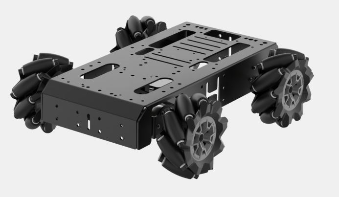
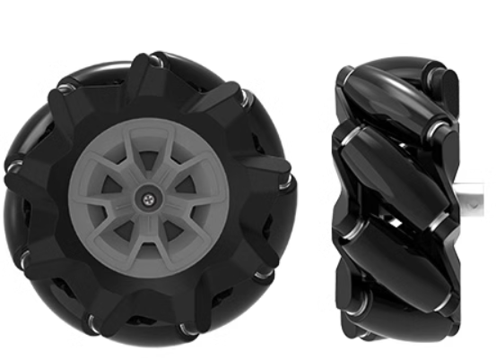
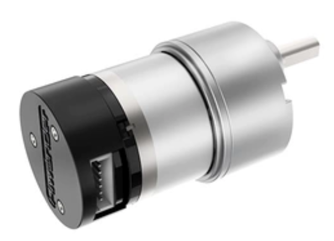
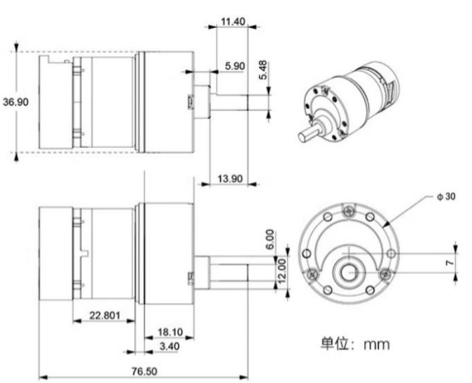

# 1. Chassis Introduction

## 1.1 Product Introduction

The Mecanum Wheel Robot Chassis is an omnidirectional vehicle, with its most notable feature being the use of Mecanum wheels. These wheels enable movement in all directions, including forward, backward, lateral, and diagonal motions, providing the chassis with exceptional flexibility and maneuverability.

Omnidirectional Movement: With Mecanum wheels, the chassis can move in any direction—forward, backward, left, right, and diagonally. This omnidirectional capability allows the chassis to be highly flexible and responsive, enabling it to navigate and adjust swiftly in complex environments.

Compact Design: The Mecanum wheel chassis features a compact structure, making it suitable for a variety of space-restricted applications.

Efficient Motion Performance: Thanks to its omnidirectional movement, the chassis can move quickly in any direction, significantly improving operational efficiency.

## 1.2 Mecanum Wheel Hardware Introduction

### 1.2.1 Hardware Structure

The Mecanum Wheel Robot Chassis features Mecanum wheels, which serve as both the motion transmission mechanism and the support structure of the chassis. These wheels are the core component of the chassis and consist of a set of rollers arranged evenly around the hub. The axis of each roller is set at an angle relative to the hub's axis, typically 45 degrees. The generatrix of the rollers forms a constant-speed helical curve or is approximated by an elliptical arc. As the wheel rotates around the hub's axis, the envelope formed by the outer surface of the rollers is a cylindrical shape, allowing the chassis to move smoothly in a continuous forward direction.

The Mecanum wheel robot uses high-torque, high-load encoded reduction motors, model `JGB37-528R131-08`. The motor operates at 8V with a reduction ratio of 1:131.

### 1.2.2 Physical Characteristics

The physical characteristics of the Mecanum wheel chassis are primarily as follows:

* **Omnidirectional Movement**

The Mecanum wheel's omnidirectional movement is based on a central wheel with several wheel axles positioned around its perimeter. These angled axles convert part of the wheel's turning force into a normal force, creating a resultant vector that enables movement in any desired direction. This allows the platform to move freely in the direction of the final resultant force without changing the direction of the wheel itself.

(1) Continuous Rolling

The wheel rim is diagonally equipped with several small rollers, enabling lateral sliding. The generatrix of these small rollers is specially designed so that when the wheel rotates around a fixed hub axis, the envelope of each small roller forms a cylindrical surface, allowing the wheel to roll continuously forward.

(2) Compact Structure

The compact structure of the Mecanum wheel provides high flexibility and is an effective solution for omnidirectional movement.

(3) Flexible Movement

By controlling the rotation speed of the four Mecanum wheels at different rates, the chassis can achieve a variety of movement patterns.

## 1.3 Development Tutorial and Kinematic Analysis

In this tutorial document, separate folders and corresponding documentation have been created for different controllers, including `Arduino Uno`, `STM32`, and `Raspberry Pi 4B`. You can choose the appropriate course based on your controller to proceed with the learning process.

## 1.4 Specification

<table  class="docutils-nobg" style="width:600px;" border="1">
  <tr>
    <th colspan="2">Mecanum-Wheel Chassis</th>
  </tr>
  <tr>
    <td colspan="2">
      
    </td>
  </tr>
  <tr>
    <td>Size</td>
    <td>30*24.5*10cm</td>
  </tr>
  <tr>
    <td>Weight</td>
    <td>1.9kg</td>
  </tr>
  <tr>
    <td>Maximum speed</td>
    <td>0.6m/s</td>
  </tr>
  <tr>
    <td>Slope climbing capability</td>
    <td>25°</td>
  </tr>
  <tr>
    <td>Payload</td>
    <td>5kg</td>
  </tr>
  <tr>
    <td>Minimum turning radius</td>
    <td>0.55m</td>
  </tr>
  <tr>
    <td>Supported controller</td>
    <td>STM32, Arduino and Raspberry Pi</td>
  </tr>
</table>

<table  class="docutils-nobg" style="width:600px;" border="1">
  <tr>
    <th colspan="2">520 Encoder DC Gear Motor</th>
  </tr>
  <tr>
    <td>Reduction ratio</td>
    <td>1:131</td>
  </tr>
  <tr>
    <td>No-load speed</td>
    <td>100rpm</td>
  </tr>
  <tr>
    <td>Rated speed</td>
    <td>90rpm</td>
  </tr>
  <tr>
    <td>Stall torque</td>
    <td>18kg*cm</td>
  </tr>
  <tr>
    <td>Stall current</td>
    <td>3.0A</td>
  </tr>
  <tr>
    <td>Rated current</td>
    <td>0.2A</td>
  </tr>
  <tr>
    <td>Rated power consumption</td>
    <td>9W</td>
  </tr>
  <tr>
    <td>Rated voltage</td>
    <td>12V</td>
  </tr>
  <tr>
    <td>Encoder type</td>
    <td>AB-phase encoder</td>
  </tr>
  <tr>
    <td>Motor type</td>
    <td>Permanent magnet brushed</td>
  </tr>
  <tr>
    <td>Output shaft</td>
    <td>6mmD-shaped eccentric shaft</td>
  </tr>
  <tr>
    <td>Encoder voltage</td>
    <td>3.3-5V</td>
  </tr>
  <tr>
    <td>Number of magnetic poles</td>
    <td>11</td>
  </tr>
  <tr>
    <td>Connector type</td>
    <td>PH2.0-6PIN</td>
  </tr>
  <tr>
    <td>Weight</td>
    <td>152+1G</td>
  </tr>
</table>

