# 2. Development Tutorial (STM32)

After the program is downloaded, the robot chassis will perform the actions in the following order:

(1) Move forward, then move backward.

(2) Move left, then move right.

(3) Rotate in place (left and right).

(4) Move diagonally to the left-front and right-back.

(5) Perform left and right drifting in place.

(6) Each action lasts for 2 seconds, with a 1-second interval between different actions.

## 2.1 STM32 Installation & Wiring

(1) Motor, Couplings & Mecanum-wheel Installation

<p>
<iframe width="100%" height="713" src="https://www.youtube.com/embed/xJ2D6Cs99mU" title="Black Mecanum-Wheel Chassis Tutorials--01 Motor, Couplings & Mecanum wheel Installation (STM32)" frameborder="0" allow="accelerometer; autoplay; clipboard-write; encrypted-media; gyroscope; picture-in-picture; web-share" referrerpolicy="strict-origin-when-cross-origin" allowfullscreen></iframe>
</p>

(2) Expansion Board Installation

<p>
<iframe width="100%" height="713" src="https://www.youtube.com/embed/XBHmd0zWU1w" title="Black Mecanum-Wheel Chassis Tutorials--02 Expansion Board Installation (STM32)" frameborder="0" allow="accelerometer; autoplay; clipboard-write; encrypted-media; gyroscope; picture-in-picture; web-share" referrerpolicy="strict-origin-when-cross-origin" allowfullscreen></iframe>
</p>

(3)  STM32 Controller & Wiring

<p>
<iframe width="100%" height="713" src="https://www.youtube.com/embed/L561XGbEPC0" title="Black Mecanum-Wheel Chassis Tutorials--04 LiPo Battery Installation (STM32)" frameborder="0" allow="accelerometer; autoplay; clipboard-write; encrypted-media; gyroscope; picture-in-picture; web-share" referrerpolicy="strict-origin-when-cross-origin" allowfullscreen></iframe>
</p>

(4) LiPo Battery Installation

<p>
<iframe width="100%" height="713" src="https://www.youtube.com/embed/Dsb5ch0HK0M" title="Black Mecanum-Wheel Chassis Tutorials--03 STM32 Controller & Wiring (STM32)" frameborder="0" allow="accelerometer; autoplay; clipboard-write; encrypted-media; gyroscope; picture-in-picture; web-share" referrerpolicy="strict-origin-when-cross-origin" allowfullscreen></iframe>
</p>

## 2.2 Hardware Introduction

### 2.2.1 STM32 Main Control Module Introduction

The main control module uses the `STM32F407VET6` microcontroller, and the motor driver chip is `YX4055` (with overcurrent protection). The voltage range is 3V–12V, depending on the motor voltage.

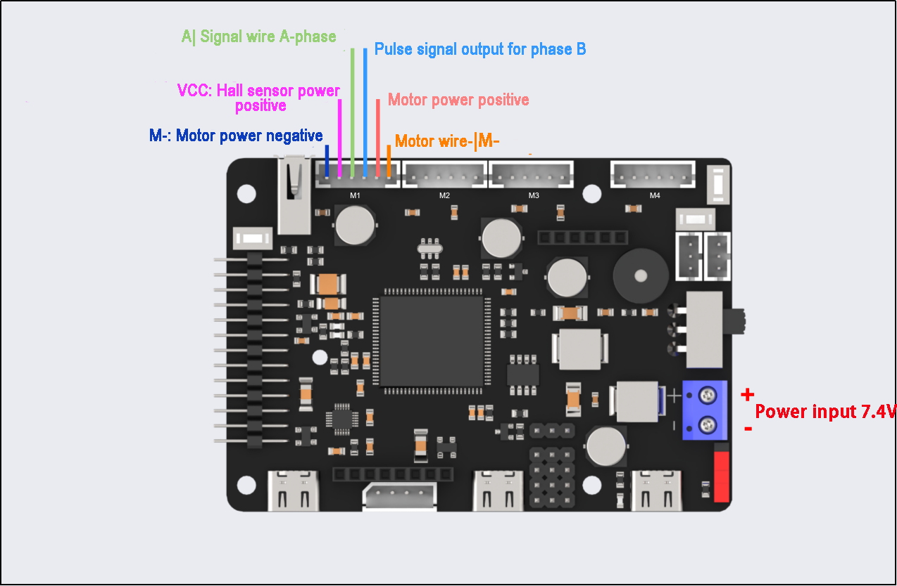

The interface layout is shown below:

<table  class="docutils-nobg" border="1">
<colgroup>
<col style="width: 32%" />
<col style="width: 36%" />
<col style="width: 30%" />
</colgroup>
<tbody>
<tr>
<td style="text-align: center;">Interface Type</td>
<td style="text-align: center;"><p>Interface Type</p>
<p>Label</p></td>
<td style="text-align: center;">Description</td>
</tr>
<tr>
<td rowspan="7" style="text-align: center;">Encoder Motor Interface</td>
<td style="text-align: center;">GND</td>
<td style="text-align: center;">Hall sensor power negative</td>
</tr>
<tr>
<td style="text-align: center;">A</td>
<td style="text-align: center;">Pulse signal output for phase A</td>
</tr>
<tr>
<td style="text-align: center;">B</td>
<td style="text-align: center;">Pulse signal output for phase B</td>
</tr>
<tr>
<td style="text-align: center;">VCC</td>
<td style="text-align: center;">Hall sensor power positive</td>
</tr>
<tr>
<td style="text-align: center;">M+</td>
<td style="text-align: center;">Motor power positive</td>
</tr>
<tr>
<td style="text-align: center;">M-</td>
<td style="text-align: center;">Motor power negative</td>
</tr>
<tr>
<td colspan="2" style="text-align: center;"><p>Notes:</p>
<p>The voltage between VCC and GND depends on the microcontroller power supply voltage (usually 3.3V or 5V).</p>
<p>When the motor rotates clockwise, the phase A signal precedes the phase B signal; when rotating counterclockwise, the phase B signal precedes the phase A signal.</p>
<p>The voltage between M+ and M- is determined by the motor voltage.</p>
</td>
</tr>
<tr>
<td rowspan="2" style="text-align: center;">Power interface</td>
<td style="text-align: center;">+</td>
<td style="text-align: center;">Positive power electrode</td>
</tr>
<tr>
<td style="text-align: center;">-</td>
<td style="text-align: center;">Negative power electrode</td>
</tr>
</tbody>
</table>

### 2.2.2 Encoder Reduction Motor

The chassis is equipped with a motor model `JGB37-528R131-08`. The designation details are as follows:

(1) J: DC motor

(2) GB: Offset output shaft

(3) 37: Gearbox diameter (mm)

(4) 528: Motor model number

(5) R131: Reduction ratio of 131:1

(6) 08: Rated voltage of 8V

The interface details are shown in the diagram below:


The Hall encoder disk is aligned with the motor's axis. As the motor rotates, the Hall sensor detects and generates a series of pulse signals. For direction detection, two sets of square wave signals with a specific phase difference are usually output.

## 2.3 Wiring Instructions

The wiring for the Mecanum-wheeled robot is as follows:

The two front motors (left and right) are connected to the M2 and M3 ports of the STM32 main control board.

The two rear motors (left and right) are connected to the M1 and M4 ports of the STM32 main control board.

The specific wiring diagram is shown below:

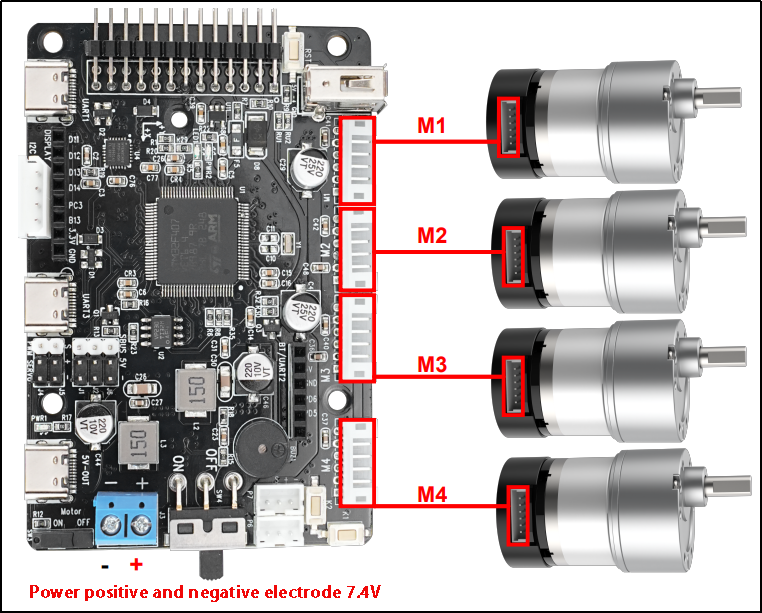

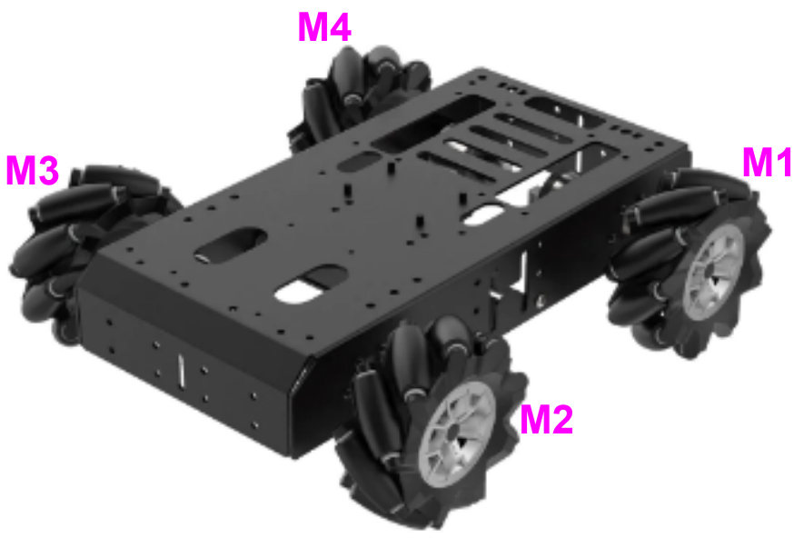

## 2.4 Program Download

[Source Code](https://drive.google.com/drive/folders/1ADelSq-o8fVjoKC-mlzrg3Q-FqtVkm05?usp=sharing)

After the project is compiled completely, download the generated hex file to the STM32 control board. Please prepare the following hardware materials:

### 2.4.1 Software & Hardware Preparation for USB Download

* **Software**

FlyMcu (it is located in ["**Appendix-> STM32 Installation Pack/ USB Serial Port Download/ FlyMcu**"](Appendix.md))


* **Hardware**

Type-C cable, STN32 main control board

### 2.4.2 USB Download Operation Steps

The specific operation steps are as follow:

* **Hardware connection**

Use Type-C cable to connect the Type-C port (UART1) of the STM32 control board and the USB port of your computer:

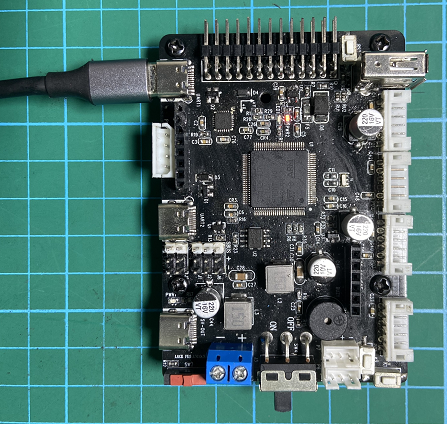

<p style="text-align:center">[UART1]</p>

* **Basic setting**

(1) Open FlyMcu. Click **"Enum Port"** at top menu bar, then set the baud rate (bps) as 115200:


(2) Click **"STMISP"** option and configure as shown in the following figure.

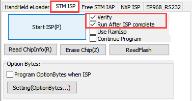

(3) Select **"DTR Low(＜-3V)，ISP @RTS High"** at the bottom.


* **Software burning**

(1) In the FlyMcu software interface, click  to select the hex file to be burned. The program below is just for your reference, please rely on the actual program. Select the hex file in ["03 Programs/RosRobotControllerM4_mecanum_8V/MDK-ARM/RosRobotControllerM4/RosRobotControllerM4.hex"](https://drive.google.com/drive/folders/1ADelSq-o8fVjoKC-mlzrg3Q-FqtVkm05?usp=sharing).


(2) Go back to the previous interface and click the **"Start ISP"** to burn the generated hex file onto the STM32 main control board:

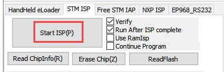

(3) The burning is in progress:

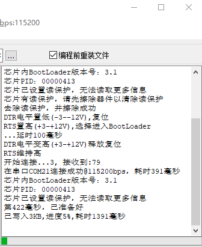

(4) When the burning is complete, you will receive the following prompt.

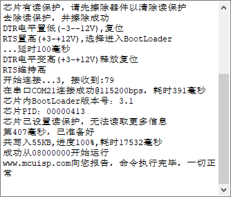

In addition to use USB method for program download, you can also use either st-link or j-link method for direct compilation and burning.

:::{Note}
To avoid the presence of any exception during the burning process, please strictly follow the above operation steps to operate!
:::

## 2.5 Program Outcome

Once the program is downloaded, the robot chassis will execute actions in the following order:

(1) Move forward, then move backward

(2) Move left, then move right

(3) Rotate left and right in place

(4) Move diagonally forward-left and backward-right

(5) Perform left and right drifting in place

Each action lasts for 2 seconds, with a 1-second interval between actions.

## 2.6 Source Code Analysis

[Source Code](https://drive.google.com/drive/folders/1ADelSq-o8fVjoKC-mlzrg3Q-FqtVkm05?usp=sharing)

### 2.6.1 Robot Motion Program Analysis

* **Robot Motion Settings**

(1) When the `chassis_init()` function is called to initialize the Mecanum-wheeled chassis, the functions within the respective chassis structure variables are linked to the corresponding control functions, as shown in the diagram below.

{lineno-start=82}
```c
	// Initialize chassis motor motion parameters  
	chassis_init();     
	// Select chassis type  
	set_chassis_type(Chassis_run_type);
```

{lineno-start=28}
```c
uint32_t Chassis_run_type = CHASSIS_TYPE_JETAUTO;
```

(2) In the program located at [..\Hiwonder\System\app.c](https://drive.google.com/drive/folders/1ADelSq-o8fVjoKC-mlzrg3Q-FqtVkm05?usp=sharing), select the appropriate function to control the robot's movement based on the chassis type. The `mecanum_control()` function is the control function for the Mecanum-wheeled chassis. First, set the movement along the X-axis (forward and backward). A speed of 200.0 means 200 millimeters per second; positive values represent forward movement, while negative values indicate backward movement.

{lineno-start=105}
```c
void mecanum_control(void)
{
    // Define motor movement speed
    // Recommended range [50, 450]
    static float speed = 300.0f;  

    // Move along the x-axis (i.e., forward movement)
    chassis->set_velocity(chassis, -200.0, 0, 0);
    osDelay(2000); // Delay for 2 seconds

    chassis->stop(chassis); // Stop
    osDelay(1000); // Delay for 1 second
    
    // Move along the x-axis (i.e., backward movement)
    chassis->set_velocity(chassis, 200.0, 0, 0);
    osDelay(2000); // Delay for 2 seconds

    chassis->stop(chassis); // Stop
    osDelay(1000); // Delay for 1 second
}
```

(3) Set the movement along the Y-axis (left and right translation) for the Mecanum-wheeled chassis. A speed of 200.0 means 200 millimeters per second; positive values represent movement to the left, while negative values represent movement to the right.

{lineno-start=127}
```c
// Moving at y-axis velocity (i.e., moving left)
chassis->set_velocity(chassis, 0, -200.0, 0);
osDelay(2000); // Delay for 2 seconds

chassis->stop(chassis); // Stop
osDelay(1000); // Delay for 1 second

chassis->set_velocity(chassis, 0, 200.0, 0);
osDelay(2000); // Delay for 2 seconds

chassis->stop(chassis); // Stop
osDelay(1000); // Delay for 1 second
```

(4) Set the linear motion of the Mecanum-wheeled chassis in the left-front and right-back directions. A speed of 200.0 means 200 millimeters per second. When the robot moves forward:

*   Positive angular velocity values indicate movement towards the left.

*   Negative angular velocity values indicate movement towards the right.

When the robot moves forward:

*   Positive angular velocity values indicate linear motion towards the left-front.
*   Negative angular velocity values indicate linear motion towards the right-front.


When the robot moves backward:
*   Negative angular velocity values indicate linear motion towards the left-back.
*   Positive angular velocity values indicate linear motion towards the right-back.

{lineno-start=186}

```c
	// Linear movement to front-left  
	chassis->set_velocity(chassis, 200.0, 0, -0.3);  // (vx, vy, omega) in mm/s and rad/s
	osDelay(2000);  // Delay for 2 seconds

	chassis->stop(chassis);  // Full stop
	osDelay(1000);  // Delay for 1 second

	// Linear movement to back-right  
	chassis->set_velocity(chassis, -200.0, 0, 0.3);  // Negative x for reverse
	osDelay(2000);  // Delay for 2 seconds

	chassis->stop(chassis);  // Full stop  
	osDelay(1000);  // Delay for 1 second
```

(5) Set the in-place rotation for the Mecanum-wheeled chassis. Positive angular velocity values indicate in-place rotation to the right, and negative angular velocity values indicate in-place rotation to the left.

{lineno-start=141}
```c
// Angular velocity movement (i.e., rotating in place to the left)
chassis->set_velocity(chassis, 0, 0, 0.5);
osDelay(2000); // Delay for 2 seconds

chassis->stop(chassis); // Stop
osDelay(1000); // Delay for 1 second

// Angular velocity movement (i.e., rotating in place to the right)
chassis->set_velocity(chassis, 0, 0, -0.5);
osDelay(2000); // Delay for 2 seconds

chassis->stop(chassis); // Stop
osDelay(1000); // Delay for 1 second
```

(6) Set the diagonal translation for the Mecanum-wheeled chassis. When `vx` and `vy` are set to a linear velocity of 100 mm/s, the robot will move diagonally at a 45°angle to the left. When `vx` and `vy` are set to a linear velocity of -100 mm/s, the robot will move diagonally at a 45° angle to the right. The combined motor speed will be 200 mm/s.

{lineno-start=156}
```c
// Diagonal movement - moving diagonally forward-left
chassis->set_velocity(chassis, -100.0, -100.0, 0);
osDelay(2000); // Delay for 2 seconds

chassis->stop(chassis); // Stop
osDelay(1000); // Delay for 1 second

// Diagonal movement - moving diagonally backward-right
chassis->set_velocity(chassis, 100.0, 100.0, 0);
osDelay(2000); // Delay for 2 seconds

chassis->stop(chassis); // Stop
osDelay(1000); // Delay for 1 second
```

(7) Set the left-right drifting motion for the Mecanum-wheeled chassis. A Boolean value of true indicates drifting to the right, and a Boolean value of false indicates drifting to the left.

{lineno-start=171}
```c
// Drift movement - drifting to the left
chassis->drift(chassis, true);
osDelay(2000); // Delay for 2 seconds

chassis->stop(chassis); // Stop
osDelay(1000); // Delay for 1 second

// Drift movement - drifting to the right
chassis->drift(chassis, false);
osDelay(2000); // Delay for 2 seconds

chassis->stop(chassis); // Stop
osDelay(1000); // Delay for 1 second
```

* **Motion Calculation**

(1) In the file located at [..\Hiwonder\Chassis\mecanum_chassis.c](https://drive.google.com/drive/folders/1ADelSq-o8fVjoKC-mlzrg3Q-FqtVkm05?usp=sharing), the motion of the Mecanum-wheeled chassis is controlled by kinematic algorithms. The `set_velocity()` function is used to control the chassis's linear motion.

{lineno-start=}
```c
// Moving at x-axis velocity (i.e., moving backward)
chassis->set_velocity(chassis, 200.0, 0, 0);
```

{lineno-start=100}
```c
void mecanum_chassis_object_init(MecanumChassisTypeDef *self)
{
    self->base.stop = stop;
	self->base.drift = drift;
    self->base.set_velocity = set_velocity;
	self->base.set_velocity_radius = set_velocity_radius;
}
```

{lineno-start=83}
```c
static void set_velocity(void *self, float vx, float vy, float angular_rate)
{
    mecanum_chassis_set_xy(self, vx, vy, angular_rate);
}

```

(2) The diagram below shows the kinematic calculation for the Mecanum-wheeled chassis. The speeds of each motor are calculated to achieve normal robot movement. The process starts with `vp`, the angular velocity around the z-axis, which is then broken down into the real-time speeds of the four motors: `v1`, `v2`, `v3`, and `v4`. These speeds are converted into rotational speeds using the `linear_speed_to_rps` function. Finally, the `set_motors()` function sets the speeds of the left and right wheels.

{lineno-start=42}
```c
void mecanum_chassis_set_xy(MecanumChassisTypeDef *self, float vx, float vy, float angular_rate)
{
```

{lineno-start=57}
```c
    float vp = angular_rate * (self->wheelbase/2 + self->shaft_length/2);
    float v1 = vx - vy - vp;
    float v2 = vx + vy + vp;
    float v3 = vx - vy + vp;
    float v4 = vx + vy - vp;
    v1 = linear_speed_to_rps(self, v1);
    v4 = linear_speed_to_rps(self, v4);
    v2 = linear_speed_to_rps(self, v2);
    v3 = linear_speed_to_rps(self, v3);
    self->set_motors(self, v1, v4, v2, v3);
}
```

(3) The `linear_speed_to_rps()` function is used to convert linear velocity into rotational speed. The `wheel_diameter` refers to the diameter of the wheel, and the `correction_factor` is a conversion factor, usually set to 1.0.

{lineno-start=8}
```c
static inline float linear_speed_to_rps(MecanumChassisTypeDef *self,  float speed)
{
    return speed / (PI * self->wheel_diameter) * self->correction_factor;
}
```

(4) The kinematic formulas used in the program for the Mecanum-wheeled chassis define the front-to-back wheelbase as `wheelbase` = H and the left-to-right track width as `shaft_length` = L, as illustrated in the diagram below:

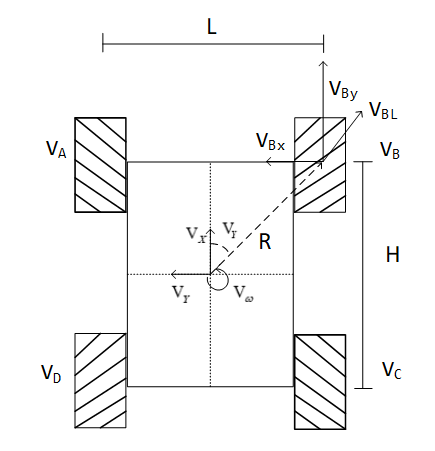

(5) Calculate the rotational speed of the four wheels based on the robot's motion state:

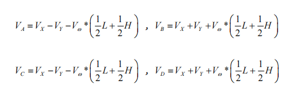

* **Stopping Motion Setting**

(1) The following function, `stop()`, sets the rotational speed of all four motors to 0, stopping the robot's motion.

{lineno-start=137}
```c
chassis->stop(chassis); //stop
```

{lineno-start=68}
```c
static void stop(void *self)
{
    ((MecanumChassisTypeDef*)self)->set_motors(self, 0, 0, 0, 0);
}
```

* **Drifting Setting**

The following function, `drift()`, sets the speeds of the two rear wheels (`v1` and `v2`) to 0.7. The positive or negative value indicates the forward or reverse direction of the motors. A Boolean value of true makes the robot drift to the right.

{lineno-start=73}
```c
static void drift(void *self, bool insitu)
{
	if(insitu) {
		((MecanumChassisTypeDef*)self)->set_motors(self, 0.7, 0, -0.7, 0);
		}else{
		((MecanumChassisTypeDef*)self)->set_motors(self, -0.7, 0, 0.7, 0);
		}
}
```

### 2.6.2 AB Quadrature Encoder Motor Analysis

The above analysis implements the basic movement of the robot. Next, we will analyze the specific motor control.

* **Timer Initialization**

(1) In the main function of the `main.c` file, several timers are initialized. I will explain this process using Motor 1 as an example, as the setup is identical for other motors. Motor 1 involves Timer 1 (PWM control for motor speed), Timer 5 (encoder for motor speed measurement), Timer 7 (timer interrupt for updating motor speed measurement and PID control frequency), along with interrupt initialization. As shown in the diagram below, the parameters are configured in STM32CubeMX. You can also check these settings in the `tim.c` file. The three timers have been configured through the STM32CubeMX software interface, which provides a more intuitive experience (it is recommended to use STM32CubeMX for better visualization).

{lineno-start=128}
```c
  MX_TIM1_Init();
```

{lineno-start=130}
```c
  MX_TIM5_Init();
```

{lineno-start=139}
```c
  MX_TIM7_Init();
```


(2) Timer 1 (PWM Control Motor Speed)

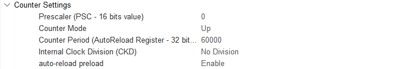

(3) Timer 5 (Encoder for Motor Speed Measurement)


(4) Timer 7 (Updates Motor Speed Measurement and PID Control Frequency)

* **Motor Initialization**

(1) Before controlling the motor, relevant motor parameters need to be initialized. The initialization function is located in the `app.c` function, found in the folder [..\Hiwonder\System\app.c](https://drive.google.com/drive/folders/1ADelSq-o8fVjoKC-mlzrg3Q-FqtVkm05?usp=sharing).

{lineno-start=63}
```c
    /* Hardware Initialization */
    motors_init();      // Motor initialization
```

(2) The following diagram shows the portion of the program for motor initialization, located in [..\Hiwonder\motor_porting.c](https://drive.google.com/drive/folders/1ADelSq-o8fVjoKC-mlzrg3Q-FqtVkm05?usp=sharing), where the motor structure is initialized. The "Chassis Motor Motion Parameter Initialization" section in the next chapter will overwrite these motor parameters. Simply choose the corresponding chassis type.

{lineno-start=43}
```c
void motors_init(void)
{
    for(int i = 0; i < 4; ++i) {
        motors[i] = LWMEM_CCM_MALLOC(sizeof( EncoderMotorObjectTypeDef));
        encoder_motor_object_init(motors[i]);
		motors[i]->ticks_overflow = 60000;
        motors[i]->ticks_per_circle = MOTOR_DEFAULT_TICKS_PER_CIRCLE;
        motors[i]->rps_limit = MOTOR_DEFAULT_RPS_LIMIT;
        motors[i]->pid_controller.set_point = 0.0f;
        motors[i]->pid_controller.kp = MOTOR_DEFAULT_PID_KP;
        motors[i]->pid_controller.ki = MOTOR_DEFAULT_PID_KI;
        motors[i]->pid_controller.kd = MOTOR_DEFAULT_PID_KD;
    }

    /* Motor 1 */
    motors[0]->set_pulse = motor1_set_pulse;
    __HAL_TIM_SET_COUNTER(&htim1, 0);
    __HAL_TIM_ENABLE(&htim1);
    __HAL_TIM_MOE_ENABLE(&htim1);
```

(3) `LWMEM_CCM_MALLOC()` dynamically creates a set of objects, allocates memory for objects of type `EncoderMotorObjectTypeDef`, and stores the memory address at the corresponding position in the `motors` array. The following diagram shows the structure parameters for motor1, located in [..\Hiwonder\Peripherals\encoder_motor.h](https://drive.google.com/drive/folders/1ADelSq-o8fVjoKC-mlzrg3Q-FqtVkm05?usp=sharing). Refer to the comments in the diagram for the specific parameter content.

{lineno-start=20}
```c
/**
 * @brief Encoder motor object structure
 */
struct EncoderMotorObject {
    int64_t counter;        /**< @brief Total count value, 64-bit to prevent overflow */
    int64_t overflow_num;   /**< @brief Overflow count */
    int32_t ticks_overflow; /**< @brief Count overflow threshold */
    float tps;              /**< @brief Ticks per second (counter frequency) */
    float rps;              /**< @brief Revolutions per second (output shaft speed) */
    int current_pulse;      /**< @brief Current PWM output value (signed for direction control) */
    PID_ControllerTypeDef pid_controller; /**< @brief PID controller */
```

(4) Initialize the defined structure (`encoder_motor_object_init`), located at [..\Hiwonder\Portings\motor_porting.c](https://drive.google.com/drive/folders/1ADelSq-o8fVjoKC-mlzrg3Q-FqtVkm05?usp=sharing).

{lineno-start=47}
```c
encoder_motor_object_init(motors[i]);
```

(5) The program in [..\Hiwonder\Peripherals\encoder_motor.c](https://drive.google.com/drive/folders/1ADelSq-o8fVjoKC-mlzrg3Q-FqtVkm05?usp=sharing) is shown in the diagram below.

{lineno-start=72}
```c
void encoder_motor_object_init(EncoderMotorObjectTypeDef *self)
{
    self->counter = 0;
    self->overflow_num = 0;
    self->tps = 0; 
    self->rps = 0;
	self->current_pulse = 0;
	self->ticks_overflow = 0; 
    self->ticks_per_circle = 9999; /* Number of encoder ticks per full rotation of the motor output shaft (set according to actual motor specifications) */
	pid_controller_init(&self->pid_controller, 0, 0, 0);
}
```

(6) Use TIM1 to generate the PWM signal, as shown in the diagram below.

{lineno-start=57}
```c
    /* Motor 1 */
    motors[0]->set_pulse = motor1_set_pulse;
    __HAL_TIM_SET_COUNTER(&htim1, 0);
    __HAL_TIM_ENABLE(&htim1);
    __HAL_TIM_MOE_ENABLE(&htim1);
```

(7) Use TIM5 to control and initialize the encoder for the motor, as shown in the diagram below.

{lineno-start=64}
```c
    __HAL_TIM_SET_COUNTER(&htim5, 0);
    __HAL_TIM_CLEAR_IT(&htim5, TIM_IT_UPDATE);
    __HAL_TIM_ENABLE_IT(&htim5, TIM_IT_UPDATE);
    __HAL_TIM_ENABLE(&htim5);
    HAL_TIM_Encoder_Start(&htim5, TIM_CHANNEL_ALL);
```

(8) Use TIM7 to calculate the encoder values to measure speed, as shown in the diagram below.

{lineno-start=115}
```c
    __HAL_TIM_SET_COUNTER(&htim7, 0);
    __HAL_TIM_CLEAR_IT(&htim7, TIM_IT_UPDATE);
    __HAL_TIM_ENABLE_IT(&htim7, TIM_IT_UPDATE);
    __HAL_TIM_ENABLE(&htim7);
```

* **Chassis Motor Motion Parameter Initialization**

In the [..\Hiwonder\System\app.c](https://drive.google.com/drive/folders/1ADelSq-o8fVjoKC-mlzrg3Q-FqtVkm05?usp=sharing) file, the chassis motor motion parameters are initialized. For the Mecanum wheel chassis, the type used is `CHASSIS_TYPE_MECANUM`.

{lineno-start=27}

```c
//Chassis Type
uint32_t Chassis_run_type = CHASSIS_TYPE_JETAUTO;
```

{lineno-start=82}
```c
    //Initialize chassis motor motion parameters
    chassis_init();     
    //Select Chassis Type
    set_chassis_type(Chassis_run_type);
```

(2) In the [..\Hiwonder\Portings\chassis_porting.c](https://drive.google.com/drive/folders/1ADelSq-o8fVjoKC-mlzrg3Q-FqtVkm05?usp=sharing) file, the function `chassis_init()` initializes the chassis motor motion parameters.

{lineno-start=73}
```c
void chassis_init(void);
```

{lineno-start=96}
```c
    mecanum_chassis_object_init(&jetauto);
    jetauto.base.chassis_type = CHASSIS_TYPE_JETAUTO;
    jetauto.correction_factor = JETAUTO_CORRECITION_FACTOR;
    jetauto.wheel_diameter = JETAUTO_WHEEL_DIAMETER;
    jetauto.shaft_length = JETAUTO_SHAFT_LENGTH;
    jetauto.wheelbase = JETAUTO_WHEELBASE;
    jetauto.set_motors = jetauto_set_motors;
```

(3) The macro definitions for the parameters can be found in [..\Hiwonder\Chassis\chassis.h](https://drive.google.com/drive/folders/1ADelSq-o8fVjoKC-mlzrg3Q-FqtVkm05?usp=sharing). The parameters include:

*   `WHEEL_DIAMETER`: The diameter of the wheels.
*   `SHAFT_LENGTH`: The axle length, i.e., the distance between the left and right wheels.
*   `WHEELBASE`: The wheelbase, i.e., the distance between the front and rear wheels.
*   `CORRECTION_FACTOR`: The conversion factor (currently unused).

{lineno-start=52}
```c
#define MINACKER_WHEEL_DIAMETER 67.0 /* mm */
#define MINACKER_CORRECITION_FACTOR 1.0 /* mm */
#define MINACKER_SHAFT_LENGTH 174.0 /* mm */
#define MINACKER_WHEELBASE  170.0 /* mm */
```

(4) Below is the initialization of the Mecanum wheel chassis motor.

{lineno-start=123}
```c
void set_chassis_type(uint8_t chassis_type)
```

{lineno-start=126}
```c
        case CHASSIS_TYPE_JETAUTO:
            chassis = (ChassisTypeDef*)&jetauto;
            set_motor_type(motors[0], MOTOR_TYPE_JGB528);
            set_motor_type(motors[1], MOTOR_TYPE_JGB528);
            set_motor_type(motors[2], MOTOR_TYPE_JGB528);
            set_motor_type(motors[3], MOTOR_TYPE_JGB528);
            break;
```

(5) Through function calls, the relevant motor parameters can be obtained from [..\Hiwonder\Portings\motors_param.h](https://drive.google.com/drive/folders/1ADelSq-o8fVjoKC-mlzrg3Q-FqtVkm05?usp=sharing).

{lineno-start=15}
```c
#define MOTOR_JGB520_TICKS_PER_CIRCLE 1320.0f
#define MOTOR_JGB520_PID_KP  63.0f
#define MOTOR_JGB520_PID_KI  2.6f
#define MOTOR_JGB520_PID_KD  2.4f
#define MOTOR_JGB520_RPS_LIMIT 1.5f
```

* **PWM Motor Speed Control**

(1) As explained in the previous section, in the function `mecanum_chassis_set_velocity`, the speeds of the four motors are set by `self->set_motors(self, v1, v4, v2, v3)`. For the Mecanum wheel chassis, `jetauto_set_motors` is used to set the speeds of the four motors.

{lineno-start=96}
```c
    mecanum_chassis_object_init(&jetauto);
    jetauto.base.chassis_type = CHASSIS_TYPE_JETAUTO;
    jetauto.correction_factor = JETAUTO_CORRECITION_FACTOR;
    jetauto.wheel_diameter = JETAUTO_WHEEL_DIAMETER;
    jetauto.shaft_length = JETAUTO_SHAFT_LENGTH;
    jetauto.wheelbase = JETAUTO_WHEELBASE;
    jetauto.set_motors = jetauto_set_motors;
```

(2) The jump to the `jetauto_set_motors` function is handled in `minacker_set_motors()`, as shown in the diagram, where the speeds of motors 1, 2, 3, and 4 are set.

{lineno-start=39}
```c
static void jetauto_set_motors(void* self, float rps_lh, float rps_lt, float rps_rh, float rps_rt)
{
    encoder_motor_set_speed(motors[3], -rps_lh);
    encoder_motor_set_speed(motors[2], -rps_lt);
    encoder_motor_set_speed(motors[0], rps_rh);
    encoder_motor_set_speed(motors[1], rps_rt);
}
```

(3) In [..\Hiwonder\Peripherals\encoder_motor.c](https://drive.google.com/drive/folders/1ADelSq-o8fVjoKC-mlzrg3Q-FqtVkm05?usp=sharing), speed limiting is implemented, and the PID controller's target speed is set.

{lineno-start=60}
```c
void encoder_motor_set_speed(EncoderMotorObjectTypeDef *self, float rps)
{
	rps = rps > self->rps_limit ? self->rps_limit : (rps < -self->rps_limit ? -self->rps_limit : rps); /* Speed limiting/clamping */
    self->pid_controller.set_point = rps; /* Set PID controller target */
}
```

(4) `encoder_motor_control()` is the function that updates the encoder motor's speed control. It adjusts the PWM values to stabilize the motor at the target speed previously set. It first updates the PID parameters, then adjusts the output PWM. The `self->set_pulse()` function sets the new PWM signal, as shown in [..\Hiwonder\Peripherals\encoder_motor.c](https://drive.google.com/drive/folders/1ADelSq-o8fVjoKC-mlzrg3Q-FqtVkm05?usp=sharing).

{lineno-start=32}
```c
/**
 * @brief Encoder motor speed control task
 * @details PID control task for encoder motor speed, requires regular timing updates
 * @param self Pointer to the encoder motor object
 * @param period Time interval since last update (update cycle) in seconds
 * @retval None.
*/
void encoder_motor_control(EncoderMotorObjectTypeDef *self, float period) 
{
	float pulse = 0;
    pid_controller_update(&self->pid_controller, self->rps, period);   /* Update PID controller */
    pulse = self->current_pulse + self->pid_controller.output; /* Calculate new PWM value */
	
	/* Clamp the output PWM value (0-100% duty cycle corresponds to 0-1000 in this example) */
    pulse = pulse > 1000 ?  1000 : pulse; 
    pulse = pulse < -1000 ? -1000 : pulse;
	
    self->set_pulse(self, pulse > -250 && pulse < 250 ? 0 : pulse); /* Set new PWM value with dead zone (motors may buzz without movement at very low PWM) */
    self->current_pulse = pulse; /* Record new PWM value */
}
```

(5) `self->set_pulse` passes the PWM values to the `motor1_set_pulse()` function. When the speed is positive, `TIM_CHANNEL_4` (forward) is activated. When the speed is negative, `TIM_CHANNEL_3` (reverse) is activated. When the speed is zero, both channels stop, and the motor halts. This process is shown in [..\Hiwonder\Portings\motor_porting.c](https://drive.google.com/drive/folders/1ADelSq-o8fVjoKC-mlzrg3Q-FqtVkm05?usp=sharing).

{lineno-start=57}
```c
    /* Motor 1 */
    motors[0]->set_pulse = motor1_set_pulse;
```

{lineno-start=123}
```c
static void motor1_set_pulse(EncoderMotorObjectTypeDef *self, int speed)
{
    if(speed > 0) {
        __HAL_TIM_SET_COMPARE(&htim1, TIM_CHANNEL_3, 0);
        __HAL_TIM_SET_COMPARE(&htim1, TIM_CHANNEL_4, speed);
    } else if(speed < 0) {
        __HAL_TIM_SET_COMPARE(&htim1, TIM_CHANNEL_4, 0);
        __HAL_TIM_SET_COMPARE(&htim1, TIM_CHANNEL_3, -speed);
    } else {
        __HAL_TIM_SET_COMPARE(&htim1, TIM_CHANNEL_3, 0);
        __HAL_TIM_SET_COMPARE(&htim1, TIM_CHANNEL_4, 0);
    }
    HAL_TIM_PWM_Start(&htim1, TIM_CHANNEL_3);
    HAL_TIM_PWM_Start(&htim1, TIM_CHANNEL_4);
}
```

(6) According to the STM32CubeMX configuration, `TIM1` has a clock frequency of 84MHz, a prescaler value of 839, and a count period of 999. The timer counts from 0 to 999 for each PWM cycle. The `pulse` is the PWM duty cycle, and when the counter reaches the duty cycle value, the high and low frequencies flip. Once the count reaches 999, the timer resets. The pulse is used to set the timer's compare match register, controlling the PWM signal's duty cycle.


(7) The timer overflow time is calculated as follows:

Timer overflow time = (prescaler + 1) * (counter period + 1) / timer clock frequency

Thus, for `TIM1`, the interrupt cycle becomes 0.01 seconds, or 10ms per update interrupt.

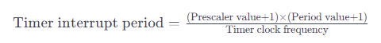

Calculation: Timer overflow time = (999+1) * (839+1) / 84MHz = 10ms

(8) The PWM duty cycle adjustment allows the motor to adjust between its maximum and minimum speeds. The motor speed limit is set to 1.5 revolutions per second in [..\Hiwonder\Portings\motors_param.h](https://drive.google.com/drive/folders/1ADelSq-o8fVjoKC-mlzrg3Q-FqtVkm05?usp=sharing).

{lineno-start=19}
```c
#define MOTOR_JGB520_RPS_LIMIT 1.5f
```

(9) Based on the interrupt function of `TIM7`, the PWM value is updated every 10 milliseconds to control the motor speed.The interrupt function is located in [..\Core\Src\stm32f4xx_it.c](https://drive.google.com/drive/folders/1ADelSq-o8fVjoKC-mlzrg3Q-FqtVkm05?usp=sharing). 

{lineno-start=504}
```c
void TIM7_IRQHandler(void)
{
  /* USER CODE BEGIN TIM7_IRQn 0 */
    extern EncoderMotorObjectTypeDef *motors[4];
    if(__HAL_TIM_GET_FLAG(&htim7, TIM_FLAG_UPDATE) != RESET) {
        __HAL_TIM_CLEAR_FLAG(&htim7, TIM_FLAG_UPDATE);
		encoder_update(motors[0], 0.01, __HAL_TIM_GET_COUNTER(&htim5));
		encoder_update(motors[1], 0.01, __HAL_TIM_GET_COUNTER(&htim2));
		encoder_update(motors[2], 0.01, __HAL_TIM_GET_COUNTER(&htim4));
		encoder_update(motors[3], 0.01, __HAL_TIM_GET_COUNTER(&htim3));
		for(int i = 0; i < 4; ++i) {
			encoder_motor_control(motors[i], 0.01);
		}
    }
```

(10) According to the STM32CubeMX configuration, `TIM7` is connected to APB1 with a clock frequency of 84MHz, and the prescaler value is set to 84, resulting in a frequency of 1MHz.

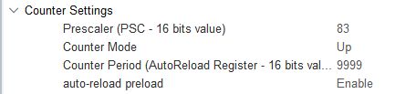

(11) Using the same formula for the timer overflow time:

Timer overflow time = (prescaler + 1) * (counter period + 1) / timer clock frequency

Calculation: Timer overflow time = (83+1) * (9999+1) / 84MHz = 10ms

* **Updating Encoder Motor Speed**

(1) **Timer 7** generates an update interrupt every 10ms to calculate the motor speed and update the PID parameters. The interrupt function is located in [..\Core\Src\stm32f4xx_it.c](https://drive.google.com/drive/folders/1ADelSq-o8fVjoKC-mlzrg3Q-FqtVkm05?usp=sharing). Within this function, **Timer 5** retrieves and updates the motor 1 encoder speed measurement.

{lineno-start=504}
```c
void TIM7_IRQHandler(void)
{
  /* USER CODE BEGIN TIM7_IRQn 0 */
    extern EncoderMotorObjectTypeDef *motors[4];
    if(__HAL_TIM_GET_FLAG(&htim7, TIM_FLAG_UPDATE) != RESET) {
        __HAL_TIM_CLEAR_FLAG(&htim7, TIM_FLAG_UPDATE);
		encoder_update(motors[0], 0.01, __HAL_TIM_GET_COUNTER(&htim5));
		encoder_update(motors[1], 0.01, __HAL_TIM_GET_COUNTER(&htim2));
		encoder_update(motors[2], 0.01, __HAL_TIM_GET_COUNTER(&htim4));
		encoder_update(motors[3], 0.01, __HAL_TIM_GET_COUNTER(&htim3));
		for(int i = 0; i < 4; ++i) {
			encoder_motor_control(motors[i], 0.01);
		}
    }
```

(2) `encoder_update()` is the function that calculates and updates the motor speed using the encoder count values. The encoder count is used to calculate the motor speed. The `overflow_num` represents the number of overflows for **Timer 5**, and the `delta_count` represents the change in the encoder count during the timer period.

The `tps` (pulses per second) is calculated by dividing the count change by the time interval. A filter with coefficients of 0.9 and 0.1 is applied to smooth the results. Finally, `rps` (revolutions per second) is the motor speed, calculated as:

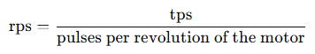

The number of pulses per revolution of the motor is detailed in the next point. The `encoder_update` function can be found in [..\Hiwonder\Peripherals\encoder_motor.c](https://drive.google.com/drive/folders/1ADelSq-o8fVjoKC-mlzrg3Q-FqtVkm05?usp=sharing).

Formula for motor speed (rps):

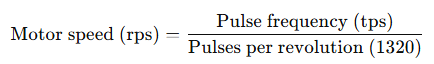

{lineno-start=15}
```c
/**
 * @brief Encoder motor speed measurement update 
 * @details
 * @param self Pointer to the encoder motor object
 * @param period Time interval since last update (update cycle) in seconds 
 * @param counter Current encoder count value
 * @retval None.
*/
void encoder_update(EncoderMotorObjectTypeDef *self, float period, int64_t counter)
{
    counter = counter + self->overflow_num * self->ticks_overflow; /* Total count value (60000 based on actual timer overflow setting) */
    int delta_count = counter - self->counter;
    self->counter = counter; /* Store new count value */
    self->tps = (float)delta_count / period * 0.9f + self->tps * 0.1f; /* Calculate pulse frequency (with first-order filtering) */
    self->rps = self->tps / self->ticks_per_circle; /* Calculate rotation speed in RPS (revolutions per second) */
}
```

(3) According to the motor manual, the motor shaft generates 11 pulses per revolution, and the gear ratio is 45:1. The timer uses a 4x frequency counting method, meaning that each revolution of the motor's output shaft results in a count change of:

11.0 * 4.0 * 30.0 = 1320

Every time the motor output shaft completes one revolution, the encoder interface records an increase of 3960 counts. This information can be found in [..\Hiwonder\Portings\motors_param.h](https://drive.google.com/drive/folders/1ADelSq-o8fVjoKC-mlzrg3Q-FqtVkm05?usp=sharing).

{lineno-start=15}
```c
#define MOTOR_JGB520_TICKS_PER_CIRCLE 1320.0f
#define MOTOR_JGB520_PID_KP  63.0f
#define MOTOR_JGB520_PID_KI  2.6f
#define MOTOR_JGB520_PID_KD  2.4f
#define MOTOR_JGB520_RPS_LIMIT 1.5f
```

As shown in the diagram, the 4x frequency counting method generates a pulse, and each pulse is counted four times. For more details on the implementation, refer to [**Appendix 3: Using Encoders**](https://drive.google.com/drive/folders/1ADelSq-o8fVjoKC-mlzrg3Q-FqtVkm05?usp=sharing).


(4) When the encoder count overflows, the interrupt for **Timer 5** is triggered. The overflow count is adjusted, with the overflow count decreasing downward and increasing upward. This functionality is shown in the program located in [..\Core\Src\stm32f4xx_it.c](https://drive.google.com/drive/folders/1ADelSq-o8fVjoKC-mlzrg3Q-FqtVkm05?usp=sharing).

{lineno-start=469}
```c
void TIM5_IRQHandler(void)
{
  /* USER CODE BEGIN TIM5_IRQn 0 */
    extern EncoderMotorObjectTypeDef *motors[4];
    if(__HAL_TIM_GET_FLAG(&htim5, TIM_FLAG_UPDATE) != RESET) {
        __HAL_TIM_CLEAR_FLAG(&htim5, TIM_FLAG_UPDATE);
        if(__HAL_TIM_IS_TIM_COUNTING_DOWN(&htim5)) {
            --motors[0]->overflow_num;
        } else {
            ++motors[0]->overflow_num;
        }
```

### 2.6.3 PID Controller for Motor Speed Stability Analysis

* **Position-based PID Algorithm**

The PID controller update function (`pid_controller_update()`) is used for position-based PID control. The implementation is as shown in the code located at [..\Hiwonder\Misc\pid.c](https://drive.google.com/drive/folders/1ADelSq-o8fVjoKC-mlzrg3Q-FqtVkm05?usp=sharing).

{lineno-start=15}
```c
void pid_controller_update(PID_ControllerTypeDef *self, float actual, float time_delta) {
	float err = self->set_point - actual;
	float proportion = err - self->previous_0_err;
	
	float integral = err * time_delta;
	float derivative = (err - 2 * self->previous_1_err + self->previous_0_err) / time_delta;
	
	self->output = (self->kp * err) + (self->ki * integral) + (self->kd * derivative);
	self->previous_1_err = self->previous_0_err;
	self->previous_0_err = err;

}
```

(1) Error Calculation (err)

The error is calculated as the difference between the target value (set point, `self->set_point`, desired speed) and the actual value (current speed, `actual`):

Error = Target value − Actual value

(2) Proportional (P) Term

The proportional term (`proportion`) represents the current error difference between the current and previous errors. This term is used to calculate the derivative (though this specific program does not use it).

Proportional = Error − Previous error

(3) Integral (I) Term

The integral term (`integral`) is the cumulative sum of errors over time. It is used in combination with the derivative term to eliminate long-term steady-state errors.

Integral = Error × Time Interval

(4) Derivative (D) Term

The derivative term (`derivative`) calculates the rate of change of the error, predicting future system behavior and quickly responding to error changes.

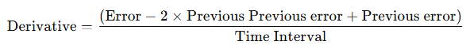

(6) PID Output to PWM Conversion

The PID controller output is stored in the output of the `PID_ControllerTypeDef` structure. After calling the `pid_controller_update()` function, the PID controller output (`self->output`) is used to adjust the PWM signal's duty cycle to control motor speed. A positive or negative PID output indicates forward or reverse rotation, respectively.

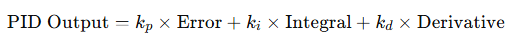

(7) Update Previous Errors

After computing the PID output, the previous and previous error parameters are updated.

(8) The program uses the standard position-based PID formula, which is expressed as shown in the following diagram:

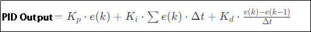