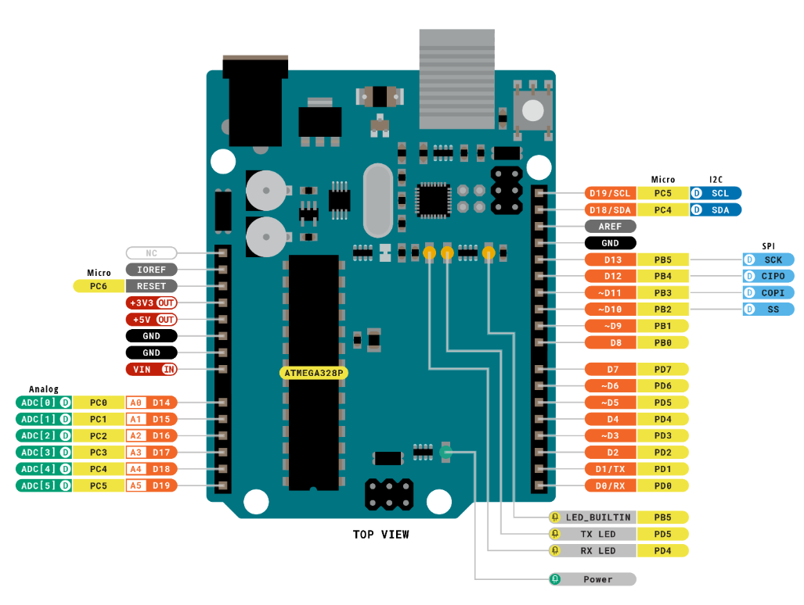
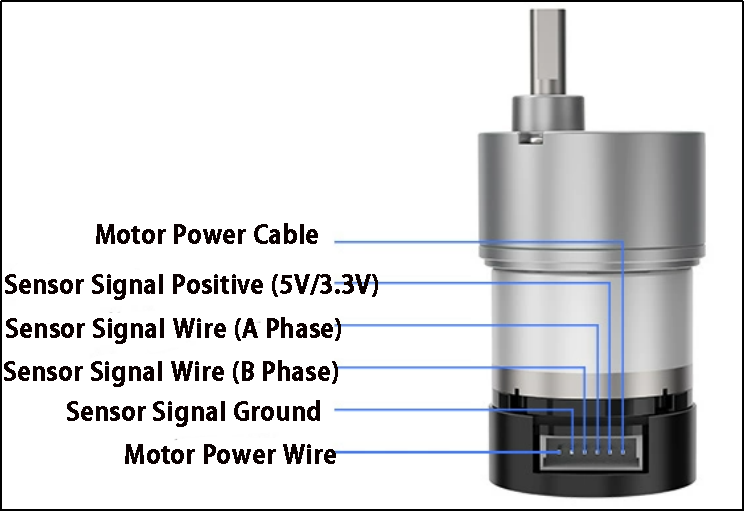
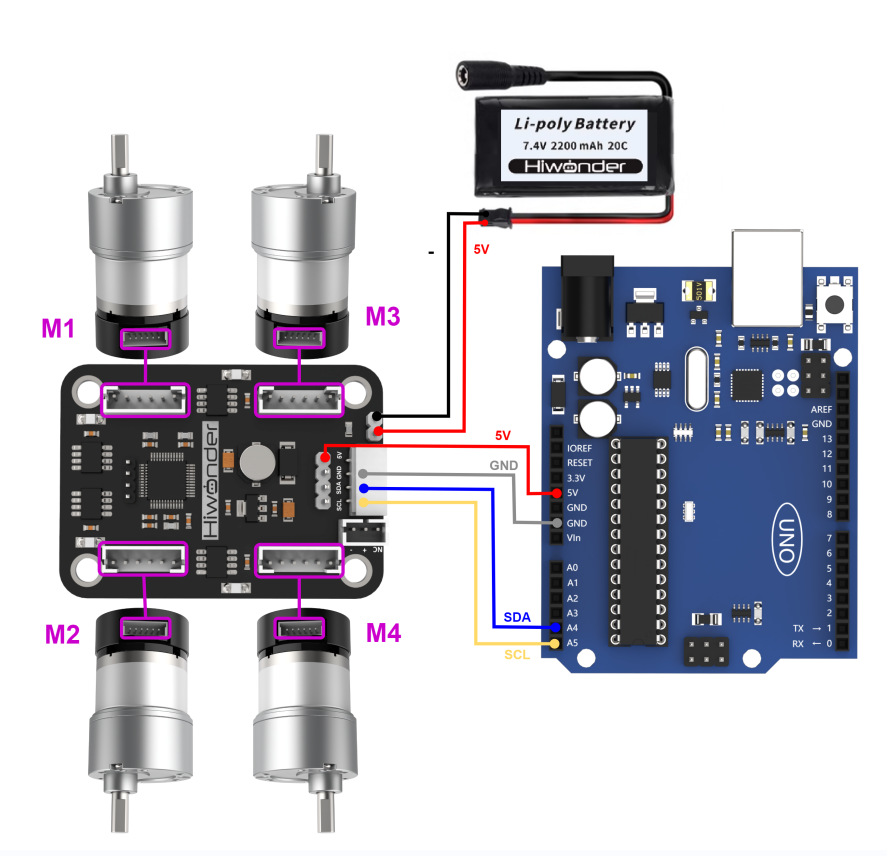
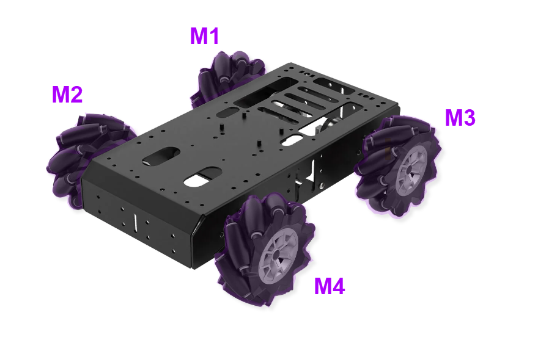
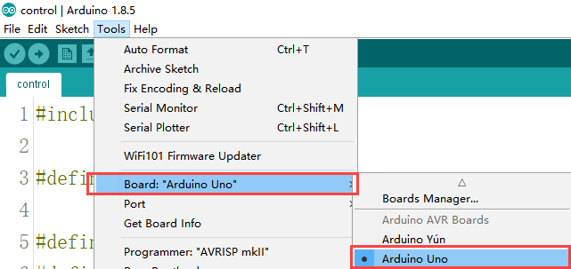
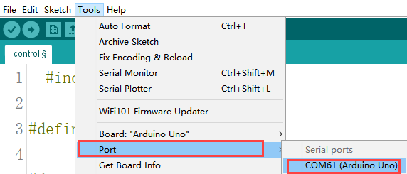
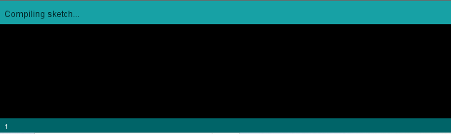
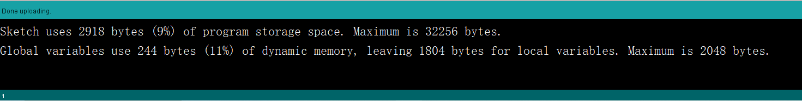
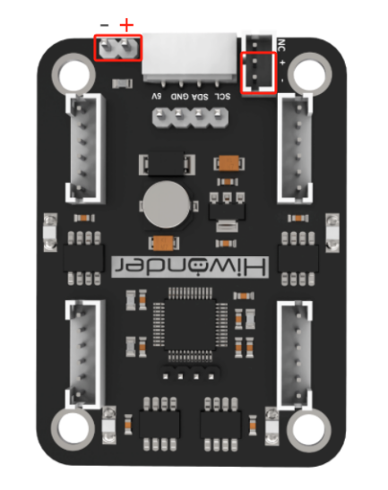

# 3. Development Tutorial (Arduino)

After the program is successfully downloaded, the robot chassis will execute the movements in the following predefined sequence:

(1) Move Forward

(2) Move Backward

(3) Move Left or Right (Lateral Movement)

(4) Turn Left or Right in Place

(5) Move Left-Forward and Right-Backward (Diagonal Movement)

(6) Drift Left or Right in Place

Each action will be executed for **2 seconds**.

There will be a **1-second interval** between the execution of different actions.

## 3.1 Arduino Installation & Wiring

(1) Hardware Required for Arduino Development

[补充视频]

(2) Motor Driver Installation

[补充视频]

(3) Arduino Installation

[补充视频]

(4) Wring

[补充视频]

(5) Battery Installation & Wiring

[补充视频]

## 3.2 Hardware Introduction

### 3.2.1 Arduino Uno

The `Arduino Uno` is a versatile and beginner-friendly open-source electronics prototyping platform. It features 14 digital input/output pins (6 of which can be used as `PWM` outputs), 6 analog input pins, a 16 MHz ceramic resonator (`CSTCE16M0V53-R0`), a USB connection, a power jack, an `ICSP` header, and a reset button.

Below is a schematic diagram of the `Arduino Uno` physical pins (please refer to your specific `Arduino Uno` board for accurate pinout details):



### 3.2.2 4-Channel Motor Driver

This motor driver module is designed to work with a microcontroller to drive TT motors or magnetic encoder motors. Each channel is equipped with a motor driver chip (`YX-4055AM`), with an operating voltage range of DC 3V-12V. The specific voltage should match the motor being connected. The pin layout is shown in the diagram below:


* **Interface Pin Description**

<table  class="docutils-nobg" border="1">
  <tr>
    <th rowspan="7">Encoder Motor Interface</th>
    <td>GND</td>
    <td>Hall power negative</td>
  </tr>
  <tr>
    <td>A</td>
    <td>Phase A pulse signal output</td>
  </tr>
  <tr>
    <td>B</td>
    <td>Phase B pulse signal output</td>
  </tr>
  <tr>
    <td>VCC</td>
    <td>Hall power positive</td>
  </tr>
  <tr>
    <td>M+</td>
    <td>Motor power positive</td>
  </tr>
  <tr>
    <td>M-</td>
    <td>Motor power negative</td>
  </tr>
  <tr>
    <td colspan="2">Note:The voltage between `VCC` and `GND` is determined by the power supply voltage of the microcontroller, typically 3.3V or 5V.<br/>When the motor shaft rotates clockwise, the A channel pulse signal precedes the B channel signal. When the shaft rotates counterclockwise, the A channel signal follows the B channel.<br/><br/>The voltage between `M+` and `M-` depends on the motor voltage.</td>
  </tr>
  <tr>
    <th rowspan="4">IIC</th>
    <td>SCL</td>
    <td>Clock line</td>
  </tr>
  <tr>
    <td>SDA</td>
    <td>Bidirectional data line</td>
  </tr>
  <tr>
    <td>GND</td>
    <td>Ground</td>
  </tr>
  <tr>
    <td>5V</td>
    <td>5V DC output</td>
  </tr>
  <tr>
    <th rowspan="3">3Pin power interface</th>
    <td>-</td>
    <td>Power negative input</td>
  </tr>
  <tr>
    <td>+</td>
    <td>Power positive input</td>
  </tr>
  <tr>
    <td>NC</td>
    <td>Not connected</td>
  </tr>
  <tr>
    <th rowspan="2">Power interface</th>
    <td>+</td>
    <td>Power positive input</td>
  </tr>
  <tr>
    <td>-</td>
    <td>Power negative</td>
  </tr>
</table>

### 3.2.3 Encoder Reduction Motor

The chassis is equipped with a motor model `JGB37-528R131-08`. The designation details are as follows:

(1) J: DC motor

(2) GB: Offset output shaft

(3) 37: Gearbox diameter (mm)

(4) 528: Motor model number

(5) R131: Reduction ratio of 131:1

(6) 08: Rated voltage of 8V

The interface details are shown in the diagram below:



## 3.3 Wiring Instructions

`Arduino Uno` with 4-Channel Encoder Motor Driver Module, powered by a 7.4V 2200mAh lithium battery to drive the motors. The following is the general wiring diagram for `Arduino Uno` control:





## 3.4 Environment Configuration and Program Download

### 3.4.1 Environment Configuration

Prior to downloading, ensure that the Arduino IDE is installed on your computer. You can find the software package in the [Appendix->Arduino Installation Package](Appendix.md).

### 3.4.2 Program Running

Open the **"car_move_demo.ino"** program saved in [Appendix->car_move_demo](Appendix.md) using Arduino IDE.

(1) Choose the Arduino development board type. In this case, select **"Arduino UNO"**



(2) Select the USB port the Arduino currently connecting to your computer. The IDE will detect it automatically; in this case, choose **"COM61"**.



(3) Connect `Arduino UNO` to the computer. Select **"Arduino UNO"** in the tool bar, and click-on  to download the program.

(4) The software will compile the program automatically. Please wait until the compilation process is successfully completed.



(5) Wait for the program to finish uploading.



### 3.4.3 Program Outcome

After downloading the program, the robot chassis will execute actions in the following predetermined order:

(1) Move forward

(2) Move backward

(3) Move left

(4) Move right

(4) Turn left

(5) Move backward left

(6) Turn right

(7) Move backward right

(8) Rotate left in place

(9) Rotate right in place

Each action will run for 2 seconds, with a 1-second interval between each action.

## 3.5 Sample Program Brief Analysis

[Source Code](../_static/source_code/car_move_demo.zip)

* **Import Necessary Libraries**

The required packages are built into the Arduino IDE. Go to **"Project -> Load Libraries"** to add them. These libraries contain methods for `IIC` communication, which are used to control the rotation of motors.

{lineno-start=1}

```
#include <Wire.h>
```
* **Initialize Communication Address**

Define macros for the `IIC` communication address and the addresses of various motor types to make future calls easier. The default `IIC` communication address for the driver board is `0x34`, which can be left as default based on your hardware. Set the encoder motor type address `MOTOR_TYPE_ADDR` to `20`. These numbers represent the address locations for writing parameters, not the actual parameter values, which depend on your hardware. Keep the defaults for now. For motor control, the address `MOTOR_FIXED_SPEED_ADDR` is set to `51`, which is the address for speed control of the four encoder motors. If speed control for the chassis motors is needed in future, you can change this address during `IIC` interface writes, but for now, keep it as default.

{lineno-start=}

```
#define I2C_ADDR        0x34

#define ADC_BAT_ADDR                  0
#define MOTOR_TYPE_ADDR               20 // Encoder motor type setting
#define MOTOR_ENCODER_POLARITY_ADDR   21 // Set encoder direction polarity
// If you find the motor speed is completely uncontrollable (either running at max speed or stopped),
// you may need to reconfigure the value at this address
// Range: 0 or 1, default is 0
#define MOTOR_FIXED_PWM_ADDR      31 // Fixed PWM control (open-loop control), range (-100~100)
//#define SERVOS_ADDR_CMD 40        
#define MOTOR_FIXED_SPEED_ADDR    51 // Fixed speed control (closed-loop control),
// Unit: pulses per 10ms. Range depends on specific encoder motor (affected by encoder line count,
// voltage, load, etc.), typically around ±50

#define MOTOR_ENCODER_TOTAL_ADDR  60 // Total pulse count for each of the 4 encoder motors
// If the pulses per revolution (U) is known and wheel diameter (D) is known,
// the travel distance can be calculated from pulse count:
// For example, if motor 1's total pulse count is P, then travel distance = (P/U) * (3.14159*D)
// For different motors, you can manually test U by rotating 10 turns and taking the average pulse count
```

(2) Initialize Motor Type

The four-channel driver module supports various types of motors, including TTL, N20, and JGB motors. All motor types are defined as macros. In this development, we are using JGB motors, so the motor type macro is set to 3.

{lineno-start=}

```
// Motor type specific values  
#define MOTOR_TYPE_WITHOUT_ENCODER        0    
#define MOTOR_TYPE_TT                     1     
#define MOTOR_TYPE_N20                    2     
#define MOTOR_TYPE_JGB                    3  // Magnetic encoder (44 pulses per revolution), gear ratio: 131 (default)  
```

* **Motor and Control Setup**

The lines `MotorType = MOTOR_TYPE_JGB` and `MotorEncoderPolarity = 0` define the motor type and encoder polarity.

① `MOTOR_TYPE_JGB` is a predefined constant representing the JGB motor model.

② `MotorEncoderPolarity = 0` sets the encoder polarity to the default configuration.

③ `Wire.begin()` starts the `IIC` bus communication and initializes it with this function.

④ The functions `WireWriteDataArray(MOTOR_TYPE_ADDR, &MotorType, 1)` and `WireWriteDataArray(MOTOR_ENCODER_POLARITY_ADDR, &MotorEncoderPolarity, 1)` send the motor type and encoder polarity to the specified addresses via the `IIC` protocol.

{lineno-start=88}

```
uint8_t MotorType = MOTOR_TYPE_JGB;
uint8_t MotorEncoderPolarity = 0; 

void setup()
{
  
  Wire.begin();
  delay(200);
  WireWriteDataArray(MOTOR_TYPE_ADDR,&MotorType,1);
  delay(5);
  WireWriteDataArray(MOTOR_ENCODER_POLARITY_ADDR,&MotorEncoderPolarity,1);
  delay(2000);
}
```

* **Movement Action Setup**

In the code, various motion types are set, including the initial motor speed for each action. For example, `car_forward[4] = {30, -30, -30, 30}` defines the motor speeds for M1, M2, M3, and M4. Since the motors may be mounted in reverse, the initial direction for forward motion must be configured. The speed range is recommended to be `[-50, 50]`.

{lineno-start=}

```
int8_t car_forward[4] = {30, -30, -30, 30};       // Forward movement
int8_t car_back[4] = {-30, 30, 30, -30};          // Backward movement

int8_t car_left_transform[4] = {-30, -30, -30, -30};  // Left strafe (sideways)
int8_t car_right_transform[4] = {30, 30, 30, 30};     // Right strafe (sideways)

int8_t car_turn_left[4] = {30, -30, -10, 10};      // Pivot turn left (forward arc)
int8_t car_turn_right[4] = {10, -10, -30, 30};     // Pivot turn right (forward arc)

int8_t car_turn_left_back[4] = {-30, 30, 10, -10};  // Reverse pivot turn left
int8_t car_turn_right_back[4] = {-10, 10, 30, -30}; // Reverse pivot turn right

int8_t car_turn_right_orin[4] = {-30, 30, -30, 30}; // In-place clockwise rotation
int8_t car_turn_left_orin[4] = {30, -30, 30, -30};  // In-place counter-clockwise rotation

int8_t car_Ob_translation_left_up[4] = {0, -30, -30, 0};  // Diagonal front-left movement
int8_t car_Ob_translation_right_up[4] = {30, 0, 0, 30};   // Diagonal front-right movement

int8_t car_Ob_translation_left_back[4] = {-30, 0, 0, -30}; // Diagonal rear-left movement
int8_t car_Ob_translation_right_back[4] = {0, 30, 30, 0};  // Diagonal rear-right movement

int8_t car_drift_left[4] = {-30, 0, -30, 0};      // Left drift 
int8_t car_drift_right[4] = {30, 0, 30, 0};       // Right drift 

int8_t car_stop[4] = {0, 0, 0, 0};                // Full stop 
```

* **Chassis Movement Execution Function**

The `Running` function is used to execute the chassis movement. The `running_mode[4]` array stores the movement mode parameters, which correspond to previously defined actions. The `WireWriteDataArray(MOTOR_FIXED_SPEED_ADDR, running_mode, 4)` function writes the current motor speeds to control movement. After a delay of 2000 milliseconds (`delay(2000)`), the stop action `car_stop` is executed, with a duration of 1 second.

{lineno-start=130}

```
void Running(int8_t running_mode[4])
{
  WireWriteDataArray(MOTOR_FIXED_SPEED_ADDR,running_mode,4);  //Perform the corresponding action.
  delay(2000);
  WireWriteDataArray(MOTOR_FIXED_SPEED_ADDR,car_stop,4);      // stop
  delay(1000);
}
```

* **Main Function**

In the main function, the previously written `Running` function is called with the corresponding action parameters, resulting in different motion effects. The functions execute in sequence, and by changing the parameters passed to the action functions, different movement sequences can be achieved.

{lineno-start=138}

```
void loop() 
{
    // Execute various movement patterns sequentially
    Running(car_forward);                   // Move forward
    Running(car_back);                      // Move backward
    Running(car_left_transform);            // Strafe left 
    Running(car_right_transform);           // Strafe right  
    Running(car_turn_left_orin);            // Rotate left in place
    Running(car_turn_right_orin);           // Rotate right in place
    Running(car_Ob_translation_left_up);    // Diagonal front-left movement
    Running(car_Ob_translation_right_back); // Diagonal rear-right movement
    Running(car_drift_left);                // Left drift maneuver
    Running(car_drift_right);               // Right drift maneuver
    
    while(1){} // Infinite loop (halt execution after completing sequence)
}
```

## 3.6 Development Notes

(1) The rated working voltage for the `Arduino Uno` is 5V, with an input voltage range of 7-12V. However, the `IIC` interface of the four-motor encoder driver module cannot be used directly to power the `Arduino Uno`, as the 5V on `IIC` only supports voltage input and not output. Since the Mecanum wheels do not have additional sensors or components, the 5V output from the `IIC` serial interface of the four-motor encoder driver module can be used to power the `Arduino Uno`.

(2) When developing independently, it is recommended not to directly connect the positive and negative power terminals of the four-motor encoder driver module to the main controller's power supply terminals if no electrical protection circuit is available. This is to prevent damage to the main controller's resistors, capacitors, or the main controller chip. The position is shown in the red box in the diagram below:
