# 4. Development Tutorials (Raspberry Pi)

After the program is downloaded, the chassis will execute actions in the following order:

(1) Move forward and backward.

(2) Move left and right (sideways).

(3) Rotate left and right in place.

(4) Move left-forward and right-backward.

(5) Drift left and right in place.

Each action will be executed for 2 seconds, with a 1-second interval between each action in the sequence.

## 4.1 Raspberry Pi 4B Installation & Wiring

(1) Components Required for Raspberry Pi Development

[补充视频]

(2) Raspberry Pi 4B Installation

[补充视频]

(3) Wiring Instruction

[补充视频]

(4) Battery Connection

[补充视频]

## 4.2 Hardware Introduction

### 4.2.1 Raspberry Pi 4B

The Raspberry Pi 4B is a compact embedded computer equipped with a 500MHz GPU. It comes with options of 1GB, 2GB, or 4GB LPDDR4 RAM, a Gigabit Ethernet port, Bluetooth 5.0, USB 3.0 ports, and a microHDMI interface. Based on these specifications, the Raspberry Pi offers a robust hardware environment for programming and development.

Below is the pinout diagram for the Raspberry Pi 4B, which will be referenced in the upcoming wiring and development process.


### 4.2.2 4-Channel Encoder Motor Driver

This motor driver module is designed to work with microcontrollers to drive TT motors or magnetic encoder motors. Each channel is equipped with an YX-4055AM motor driver chip, which supports a voltage range of DC 3V-12V, depending on the voltage of the connected motor. The interface layout is shown in the diagram below.

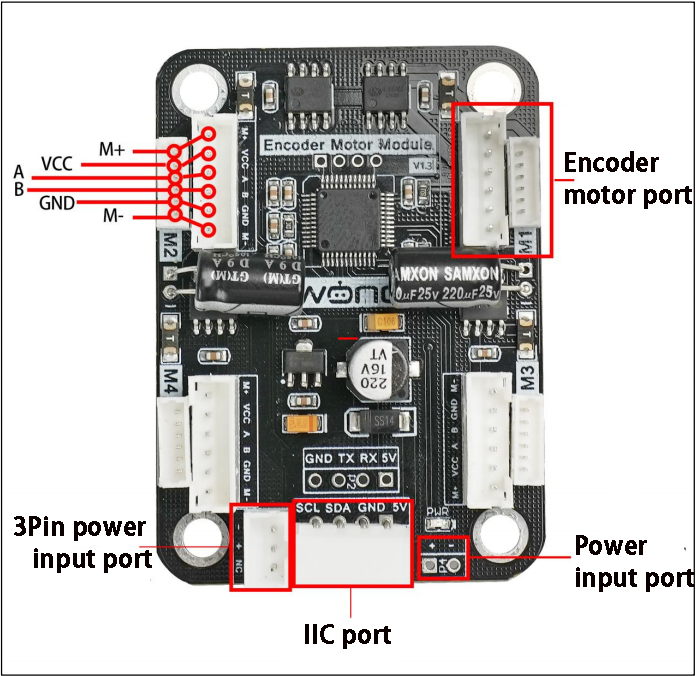

* **Interface Pin Description**

<table  class="docutils-nobg" border="1">
  <thead>
    <tr>
      <th>Interface Type</th>
      <th>Pin Number</th>
      <th>Description</th>
    </tr>
  </thead>
  <tbody>
    <tr>
      <td rowspan="7">Encoder Motor Interface</td>
      <td>GND</td>
      <td>Hall power negative</td>
    </tr>
    <tr>
      <td>A</td>
      <td>Phase A pulse signal output</td>
    </tr>
    <tr>
      <td>B</td>
      <td>Phase B pulse signal output</td>
    </tr>
    <tr>
      <td>VCC</td>
      <td>Hall power positive</td>
    </tr>
    <tr>
      <td>M+</td>
      <td>Motor power positive</td>
    </tr>
    <tr>
      <td>M-</td>
      <td>Motor power negative</td>
    </tr>
    <tr>
      <td colspan="2">The voltage between VCC and GND is determined by the power supply voltage of the microcontroller, typically 3.3V or 5V.<br/><br/>When the motor shaft rotates clockwise, the A channel pulse signal precedes the B channel signal. When the shaft rotates counterclockwise, the A channel signal follows the B channel.<br/><br/>The voltage between M+ and M- depends on the motor voltage.</td>
    </tr>
    <tr>
      <td rowspan="4">IIC</td>
      <td>SCL</td>
      <td>Clock line</td>
    </tr>
    <tr>
      <td>SDA</td>
      <td>Bidirectional data line</td>
    </tr>
    <tr>
      <td>GND</td>
      <td>Ground</td>
    </tr>
    <tr>
      <td>5V</td>
      <td>5V DC output</td>
    </tr>
    <tr>
      <td rowspan="3">3Pin power interface</td>
      <td>-</td>
      <td>Power negative input</td>
    </tr>
    <tr>
      <td>+</td>
      <td>Power positive input</td>
    </tr>
    <tr>
      <td>NC</td>
      <td>Not connected</td>
    </tr>
    <tr>
      <td rowspan="2">Power interface</td>
      <td>+</td>
      <td>Power positive input</td>
    </tr>
    <tr>
      <td>-</td>
      <td>Power negative</td>
    </tr>
  </tbody>
</table>

### 4.2.3 Encoder Reduction Motor

The chassis is equipped with a motor model JGB37-528R131-08. The designation details are as follows:

(1) J: DC motor

(2) GB: Offset output shaft

(3) 37: Gearbox diameter (mm)

(4) 528: Motor model number

(5) R131: Reduction ratio of 131:1

(6) 08: Rated voltage of 8V

The interface details are shown in the diagram below:

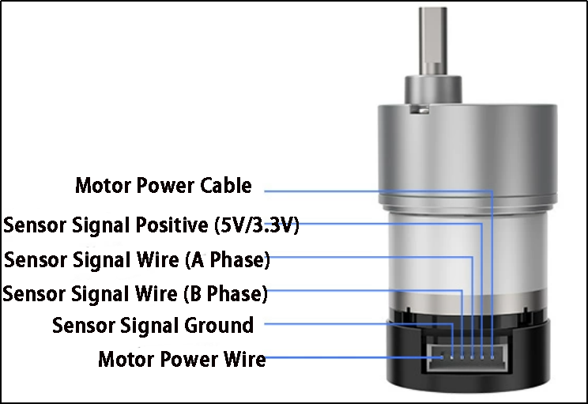

The Hall encoder disk is mounted coaxially with the motor. As the motor rotates, the Hall sensor detects and outputs a series of pulse signals. To determine the direction of rotation, two square wave signals with a certain phase difference are typically output.

## 4.3 Wiring

In this example, the Raspberry Pi controller is used along with the 4-channel encoder motor driver module, powered by a 7.4V 3500mAh lithium battery. The wiring diagram is shown below.

In the diagram, the left motor on the front side of the vehicle is labeled M1, and the right motor is labeled M3. The remaining wiring content is a rendered image, where the pin layout matches the physical connections. Please note that the actual application effect is not affected by this rendering, and the real physical setup should be used as the reference.

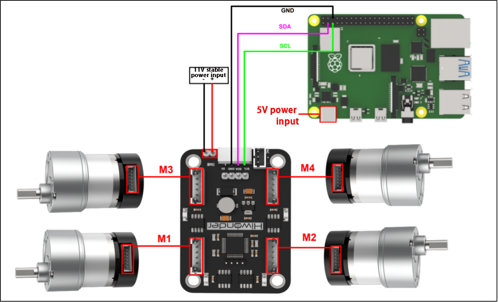

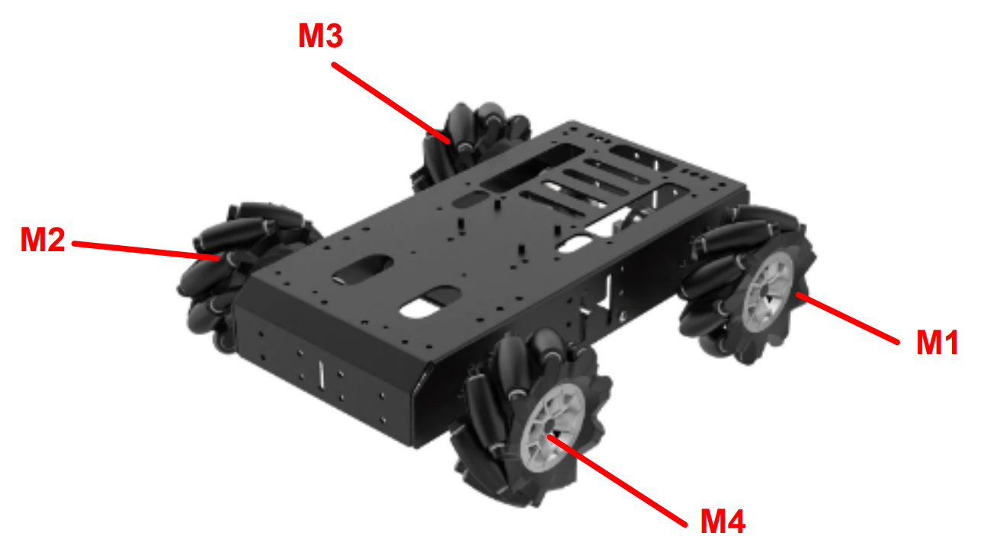

## 4.4 Environment Setup and Program Execution

### 4.4.1 Environment Setup

Install NoMachine on the computer. The software package can be found under [Appendix->Remote Desktop Connection Tools (for Raspberry Pi)](Appendix.md). Follow the instructions in the **NoMachine Installation and Usage** document in the folder for installation and configuration.

### 4.4.2 Executing the Program

Place the Program Files in the Specified Directory

(1) Open NoMachine and connect to the robot.

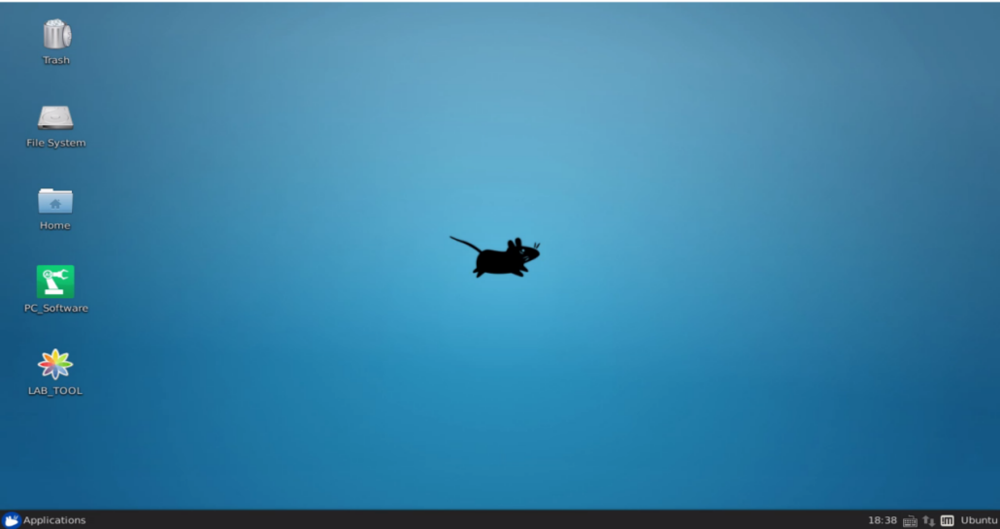

(2) Drag the demo file from the path [Appendix->Programs](Appendix.md) to the desktop, as shown in the figure below. Wait for the program to load on the desktop.

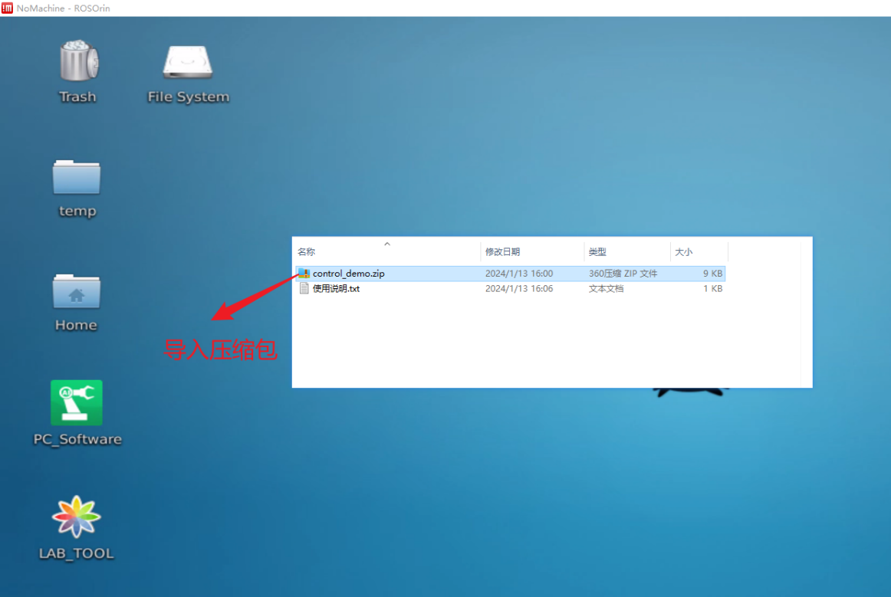

Wait for the program to load onto the desktop.

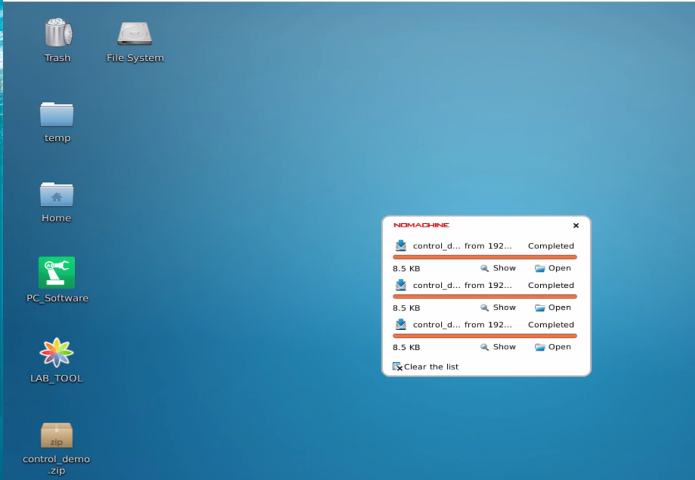

(3) Extract the package to the desktop by entering the command:

```
unzip control_demo.zip
```

(4) Copy the package to the `/home/ubuntu/armpi_pro/src/` directory.

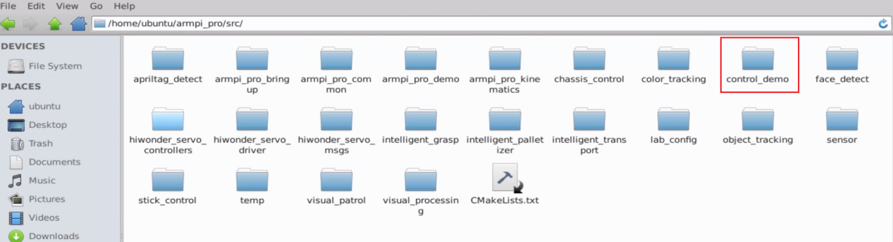

(5) Open a terminal in the `/home/ubuntu/armpi_pro/` directory.

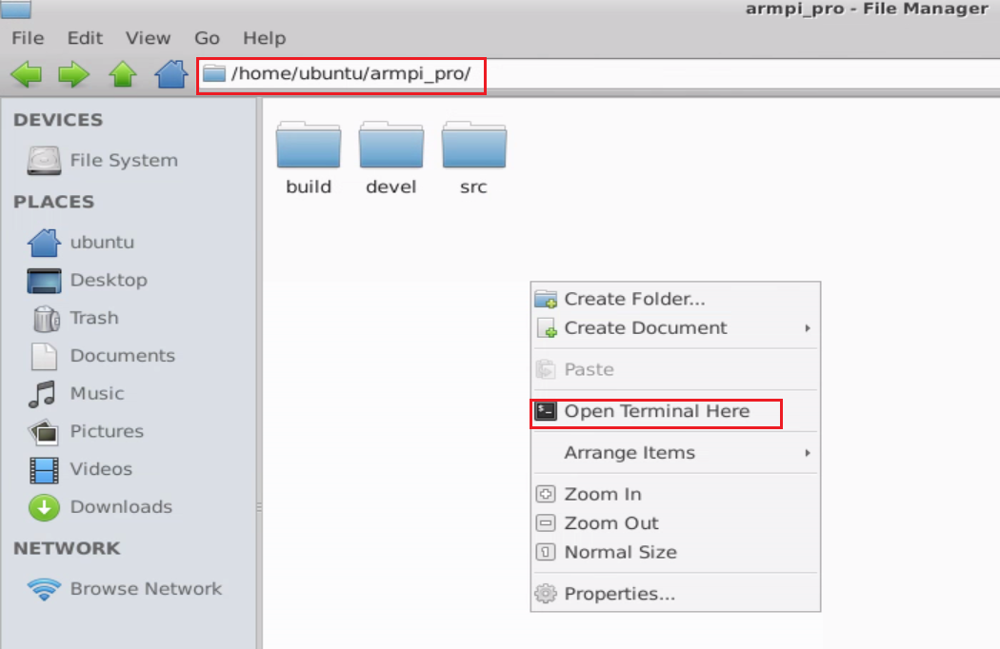

(6) Enter the command `catkin_make` to compile the package. The compilation will take approximately 4 minutes to complete.

```
catkin_make
```

(7) Enter the following commands to grant execute permissions to the programs:

```
chmod +x ~/armpi_pro/src/control_demo/scripts/chassis_control_node.py
```

```
chmod +x ~/armpi_pro/src/control_demo/scripts/controller_demo.py
```

(8) Open a new terminal and enter the following command:

```
roslaunch control_demo controller_demo.launch
```

This will start the robot's control program. Ensure that I2C communication is connected and the battery is properly powered to avoid errors during program execution.

(9) Wait for the program to load. Once the loading process is complete, the robot will perform the corresponding movements as defined in the program.

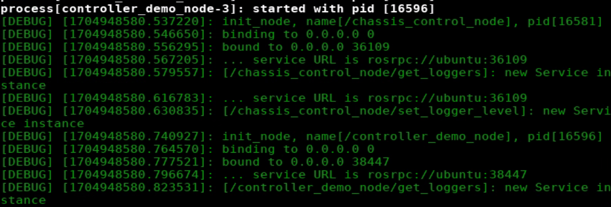

(10) To exit the program, press Ctrl+C in the terminal. This will safely terminate the running program.

### 4.4.3 Program Outcome

After the program is loaded, the robot chassis will execute the following actions in the preset order:

(1) Move forward and backward

(2) Move left and right laterally

(3) Rotate left and right in place

(4) Move diagonally forward-left and backward-right

(5) Drift left and right in place

Each action lasts for **2 seconds**, with a **1-second** interval between actions in sequence.

## 4.5 Brief Analysis of Example Program

[Source Code](../_static/source_code/control_demo.zip)

* **Importing Necessary Modules**

The initial setup and library imports in the `chassis_control_node.py` and `controller_demo.py` scripts include several critical components. Key points to note are as follows:

(1) Shebang Line (#!/usr/bin/env python3): This line specifies the interpreter to be used for executing the script. It searches for the `python3` interpreter in the system's PATH environment variable and ensures the script is executed with the correct interpreter.

(2)  `sys` Module: Used for interacting with the system, enabling system-level control and operations.

(3)  `rospy` Module: A Python library for ROS (Robot Operating System) that facilitates starting ROS services and executing corresponding functionalities.

(4)  `smbus2` Library: An open-source Python library for I2C communication, enabling control of the robot's motors.

It can be installed using the following command:

```bash
pip install smbus2
```

(5) from `control_demo.msg` import `SetVelocity` from `control_demo.msg` import `SetSpeed`

These imports bring in the `SetVelocity` and `SetSpeed` message types, which are crucial for defining and handling motor control commands within the program.

{lineno-start=1}
```python
#!/usr/bin/python3
# coding=utf8
# Date:2022/03/30
import sys
import math
import rospy
import smbus2
from threading import Thread
from std_msgs.msg import *
from control_demo.msg import *
from armpi_pro import Misc
```

{lineno-start=1}
```python
#!/usr/bin/env python3
import sys
import rospy
from control_demo.msg import SetVelocity
from control_demo.msg import SetSpeed
```

### 4.5.1 Motion Functions

* **Forward and Reverse Motion**

(1) In the command `publish(150, 90, 0)`,

(2) 150 refers to the linear speed of 150mm per second,

(3) 90 indicates the robot's direction at 90° (moving forward),

(4) 270 would indicate a reverse direction,

(5) The last value, 0, refers to zero angular velocity (no rotation).

(6) This command is implemented in `controller_demo.py`.

{lineno-start=32}
```python
set_velocity.publish(150, 90, 0)  # Control the chassis to move forward: linear velocity 150, direction angle 90, yaw rate 0 (positive values indicate clockwise rotation)
rospy.sleep(2)
set_velocity.publish(0, 0, 0)  # Stop movement
rospy.sleep(1)

set_velocity.publish(150, 270, 0)  # Control the chassis to move backward: linear velocity 150, direction angle 270, yaw rate 0 (positive values indicate clockwise rotation)
rospy.sleep(2)
set_velocity.publish(0, 0, 0)  # Stop movement
rospy.sleep(1)
```

* **Left and Right Translation**

(1) For the leftward translation, `publish(150, 180, 0)` is used, where 180 indicates a direction toward the left.

(2) The direction angles from 90° to 270° correspond to movements in various angles on the left side of the robot.

(3) When the direction is 0°, the robot will translate right, and 270° to 360°, along with 0° to 90°, indicate movements in various angles on the right side of the robot.

{lineno-start=43}
```python
set_velocity.publish(150, 180, 0)  # Control the chassis to move diagonally forward-left: linear velocity 150, direction angle 180, yaw rate 0 (positive values indicate clockwise rotation)
rospy.sleep(2)
set_velocity.publish(0, 0, 0)  # Stop movement
rospy.sleep(1)

set_velocity.publish(150, 0, 0)  # Control the chassis to move diagonally forward-right: linear velocity 150, direction angle 0, yaw rate 0 (positive values indicate clockwise rotation)
rospy.sleep(2)
set_velocity.publish(0, 0, 0)  # Stop movement
rospy.sleep(1)
```

* **Stationary Left and Right Turns**

(1) In the command `publish(0, 90, -0.3)`,

(2) 0 refers to the linear speed, which is zero (no forward motion),

(3) 90 is the angle for the turn,

(4) -0.3 is the angular velocity, where a negative value indicates a leftward turn (clockwise rotation).

(5) This is implemented for rotating the robot in place.

{lineno-start=54}
```python
set_velocity.publish(0, 90, -0.3)  # Control the chassis to rotate left in place: linear velocity 0, direction angle 90, yaw rate -0.3 (positive values indicate clockwise rotation)
rospy.sleep(2)
set_velocity.publish(0, 0, 0)  # Stop movement
rospy.sleep(1)

set_velocity.publish(0, 90, 0.3)  # Control the chassis to rotate right in place: linear velocity 0, direction angle 90, yaw rate 0.3 (positive values indicate clockwise rotation)
rospy.sleep(2)
set_velocity.publish(0, 0, 0)  # Stop movement
rospy.sleep(1)
```

* **Left Forward and Right Reverse Movements**

(1) For the left forward and right reverse motion, `publish(150, 135, 0)` is used.

(2) 150 refers to the linear speed of 150mm per second,

(3) 135° indicates moving 45° leftward (diagonal forward-left direction).

(4) Similarly, `publish(150, 315, 0)` would make the robot move 45° rightward in the opposite diagonal (reverse-right direction).

{lineno-start=}
```python
set_velocity.publish(150, 135, 0)  # Control chassis to move diagonally forward-left: linear velocity 150, direction angle 135°, yaw rate 0 (positive = clockwise)
rospy.sleep(2)
set_velocity.publish(0, 0, 0)  # Stop movement
rospy.sleep(1)

set_velocity.publish(150, 315, 0)  # Control chassis to move diagonally forward-right: linear velocity 150, direction angle 315°, yaw rate 0
rospy.sleep(2)
set_velocity.publish(0, 0, 0)  # Stop movement
rospy.sleep(1)
```

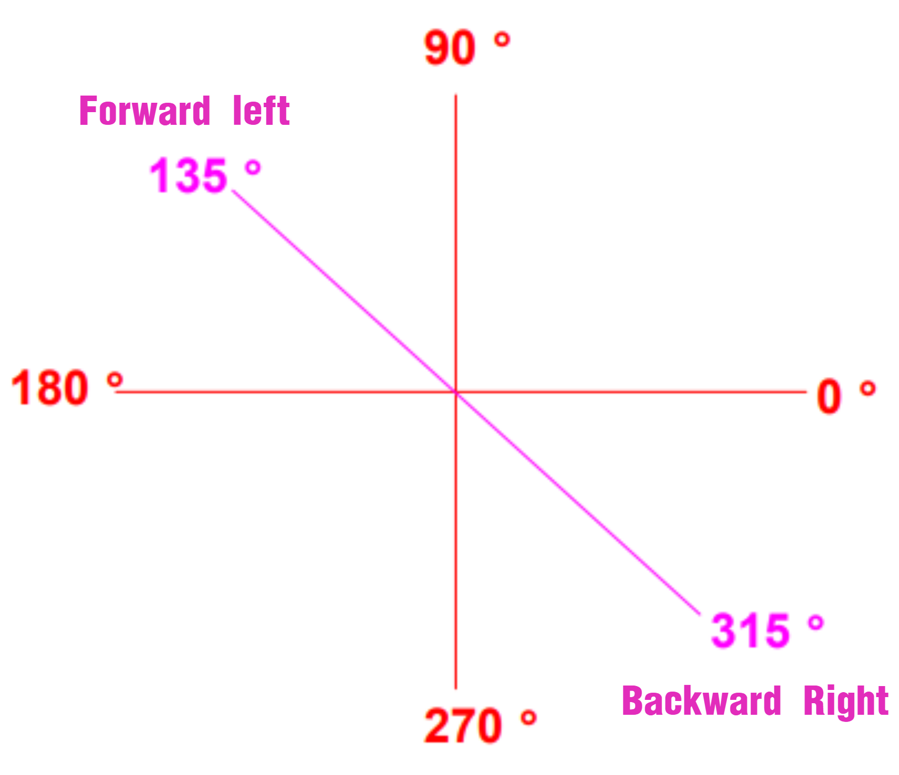

* **Left and Right Drifting**

(1) The command `publish(-150, 150, 0, 0)` is used to perform drifting.

(2) -150 and 150 represent the speed of the robot's left and right wheels respectively.

(3) The values `v1`, `v4`, `v2`, `v3` represent the left-back wheel, right-back wheel, left-front wheel, and right-front wheel, respectively.

(4) The sequence of values indicates the desired speed for each wheel to achieve drifting movement.

{lineno-start=69}
```python
set_speed.publish(-150, 150, 0, 0)  # Control chassis to drift left: left wheel speed -150, right wheel speed 150 (differential drive)
rospy.sleep(2)
set_speed.publish(0, 0, 0, 0)  # Stop movement 
rospy.sleep(1)

set_speed.publish(150, -150, 0, 0)  # Control chassis to drift right: left wheel speed 150, right wheel speed -150
rospy.sleep(2)
set_speed.publish(0, 0, 0, 0)  # Stop movement
rospy.sleep(1)
```

### 4.5.2 Motion Calculation

* **Initialization of Chassis Motion Parameters**

(1) `a` = 219: This represents the distance between the left and right wheels of the chassis, 219mm.

(2) `b` = 193: This represents the distance between the front and rear wheels, 193mm.

(3) `pulse_per_cycle` = 4 * 11 * 131: This calculates the total number of pulse changes per second. The 4x frequency, 11 lines, and 131 reduction ratio determine how pulses are generated during motor operation.

{lineno-start=48}
```python
    def __init__(self, a=219, b=193, wheel_diameter=96.5, pulse_per_cycle=4 * 11 * 131):
        self.motor_controller = EncoderMotorController(1)
        self.a = a
        self.b = b
        self.wheel_diameter = wheel_diameter
        self.pulse_per_cycle = pulse_per_cycle
        self.velocity = 0
        self.direction = 0
        self.angular_rate = 0
```

* **Motion Calculation in set_velocity Function**

(1) The `set_velocity` function performs motion calculation, determining the speed of each motor for different motion types.

(2) `velocity`: Linear speed, measured in millimeters per second (mm/s).

(3) `direction`: The direction of movement, measured in degrees (0~360 degrees), where 270° represents moving forward.

(4) `angular_rate`: The angular velocity, representing the rotation speed of the chassis.

{lineno-start=73}
```python
    def set_velocity(self, velocity, direction, angular_rate, fake=False):
```

* **Conversion from Degrees to Radians**

(1) `rad_per_deg`: The conversion factor from degrees to radians, since `math.cos` and `math.sin` functions use radians.

(2) Next, the horizontal (`vx`) and vertical (`vy`) speed components are calculated based on the input linear speed (`velocity`) and direction (`direction`).

(3) `vp`: A variable that is determined by the rotational speed (`angular_rate`), the distance between the left and right wheels (`self.a`), and the distance between the front and rear wheels (`self.b`). This is used to calculate the speed of the chassis rotation.

{lineno-start=}
```python
        velocity = -velocity
        angular_rate = -angular_rate
        
        rad_per_deg = math.pi / 180  
        vx = velocity * math.cos(direction * rad_per_deg)  
        vy = velocity * math.sin(direction * rad_per_deg)
        vp = angular_rate * (self.a/2 + self.b/2)
        v1 = vy - vx + vp
        v2 = vy + vx - vp
        v3 = vy - vx - vp
        v4 = vy + vx + vp
        v_s = [int(self.speed_covert(v)) for v in [-v1, v4, v2, -v3]]
        if fake:
            return v_s

        self.motor_controller.set_speed(v_s)
        self.velocity = velocity
        self.direction = direction
        self.angular_rate = angular_rate
```

* **Conversion of Linear Speed to Wheel Speed**

(1) The circumference of each wheel is calculated as `math.pi` * `self.wheel_diameter`.

(2) The wheel speed is then converted to the number of pulses generated per rotation.

(3) `pulse_per_cycle` = 4 * 11 * 131 = 5764 is the number of pulses generated by the motor per full wheel rotation.

(4) By multiplying by a 10ms time interval, the number of pulses for the motor in 10ms is calculated. This conversion is essential because the motor controller and encoder use pulses to quantify and control motor speed.

{lineno-start=96}
```python
        v_s = [int(self.speed_covert(v)) for v in [-v1, v4, v2, -v3]]
        if fake:
            return v_s
```

{lineno-start=58}
```python
    def speed_covert(self, speed):
        """
        covert speed mm/s to pulse/10ms
        :param speed:
        :return:
        """
        return speed / (math.pi * self.wheel_diameter) * self.pulse_per_cycle * 0.01  # pulse/10ms
```

### 4.5.3 Setting Up Drifting Motion

(1) In the `chassis_control_node.py` program, add a topic subscription and initialize the `chassis_control_node` node. Then, set up the topic subscription:

{lineno-start=227}
```python
if __name__ == '__main__':
     
    rospy.init_node('chassis_control_node', log_level=rospy.DEBUG)
    
    set_velocity_sub = rospy.Subscriber('/chassis_control/set_velocity', SetVelocity, Set_Velocity)
    set_translation_sub = rospy.Subscriber('/chassis_control/set_translation', SetTranslation, Set_Translation)
    set_speed_sub = rospy.Subscriber('/chassis_control/set_speed', SetSpeed, Set_Speed)
```

(2) Add the `Set_Speed(msg)` callback function to handle the incoming messages.

{lineno-start=219}
```python
def Set_Speed(msg):

    v1 = msg.v1
    v2 = msg.v2
    v3 = msg.v3
    v4 = msg.v4
    chassis.set_Speed(v1,v2,v3,v4)
```

(3) In the `MecanumChassis` class, implement the `set_Speed(self, v1, v2, v3, v4)` function to convert the velocity values and set the speeds of each motor.

{lineno-start=105}
```python
    def set_Speed(self, v1, v2, v3, v4):

        v_s = [int(self.speed_covert(v)) for v in [-v1, v4, v2, -v3]]

        self.motor_controller.set_speed(v_s)
```

(4) In the `controller_demo.py` program, import the `SetSpeed` message and publish the speeds for the two rear motors.

{lineno-start=5}
```python
from control_demo.msg import SetSpeed
```

{lineno-start=74}
```python
    set_speed.publish(-150, 150, 0, 0)
```

(5) Add a new `SetSpeed.msg` file in the path `/home/ubuntu/armpi_pro/src/chassis_control/msg/`. The content of the message is as follows:

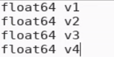

(6) Modify the `CMakeLists.txt` file in the `/home/ubuntu/armpi_pro/src/control_demo/` path to include the `SetSpeed.msg` message.

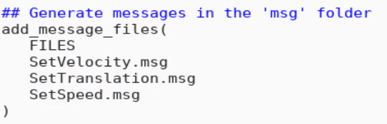

(7) The provided example is already set up, but if new messages are added or changes are made, you need to navigate to the `/home/ubuntu/armpi_pro` directory and run the following command to compile the changes:


### 4.5.4 I2C Communication for Motor Speed Control

The `smbus2.SMBus` is used to create an I2C communication instance, allowing communication between the Raspberry Pi and the four-channel encoder motor module via the SMBus/I2C interface.

(1) If motor_id is not specified, the function will send the same speed command to all motors.

(2) If a `motor_id` is specified, the function will send the speed command only to the specific motor. The `motor_id` value should be between 1 and 4.

The speed command is sent to the motor control module using the `bus.write_i2c_block_data` function. The motor module's I2C address is defined as `ENCODER_MOTOR_MODULE_ADDRESS` = 0x34.

Here's an example of how this can be implemented:

{lineno-start=25}
```python
    def set_speed(self, speed, motor_id=None, offset=0):
        global th
        
        with smbus2.SMBus(self.i2c_port) as bus:
            try:
                if motor_id is None:
                    bus.write_i2c_block_data(ENCODER_MOTOR_MODULE_ADDRESS, 51 + offset, speed)
                else:
                    if 0 < motor_id <= 4:
                        bus.write_i2c_block_data(ENCODER_MOTOR_MODULE_ADDRESS, 50 + motor_id, [speed, ])
                    else:
                        raise ValueError("Invalid motor id")

            except Exception as e:
                th = None
                print(e)
```

## 4.6 Development Considerations

### 4.6.1 Power Supply for Raspberry Pi 4B 

(1) The Raspberry Pi 4B operates with a rated voltage of 5V. It cannot directly use the I2C interface (5V, GND, SCL, SDA) of the four-channel encoder motor driver module for power supply. This is because the 5V pin on the motor driver module only supports voltage input, not output. Additionally, it is not recommended to power the Raspberry Pi GPIO pins through other interfaces of the motor driver module.

(2) Recommended Power Solution

A dual power supply setup is suggested. Use an external power supply to power the motor driver module (e.g., an 11.1V lithium battery, fully charged to 12V), while powering the Raspberry Pi 4B with a separate 5V, 3A power supply.

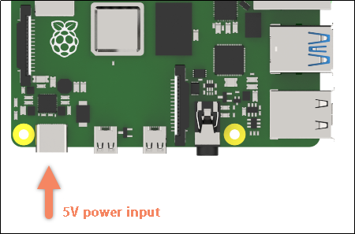

### 4.6.2 Why Not Power Through GPIO Pins? 

(1) It is important not to power the Raspberry Pi through its GPIO pins for the following reasons:

(2) No Protection Circuit: The GPIO pins do not have extra protection circuitry. Supplying power through the GPIO can cause voltage instability, which may lead to excessive current that could damage the internal CPU and components.

(3) Current Instability: If the current from the GPIO is insufficient or too low, the Raspberry Pi 4B may fail to operate properly. On the other hand, if the current is too high, it could damage the internal components of the Raspberry Pi.

### 4.6.3 Recommended Power Supply for Raspberry Pi 

(1) To ensure stable operation, it is recommended to use a Type-C power supply for the Raspberry Pi. A power bank with stable current and voltage (e.g., 5V, 2.5A or 5V, 3A) will suffice and guarantee the normal operation of the Raspberry Pi 4B.

(2) Using a dedicated power supply for the Raspberry Pi not only ensures stable operation but also saves the 5V and GND pins for other uses, which is beneficial for expanding the capabilities of the Raspberry Pi.

(3) By following these power guidelines, you can ensure the stable performance of both the Raspberry Pi and the motor driver module without risk of damage due to improper power supply configurations.

### 4.6.4Raspberry Pi Encoder Pin Wiring Diagram

The following diagram illustrates the physical pinout of the Raspberry Pi. It shows two types of pin numbering systems: BCM (Broadcom) and wiringPi. When programming, you can choose either encoding method and set it accordingly in your code.

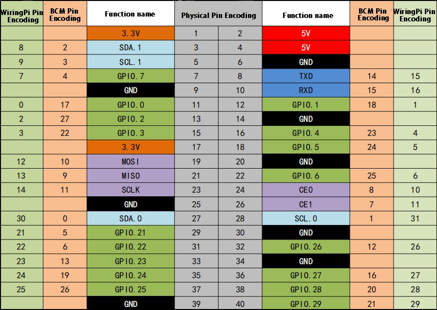